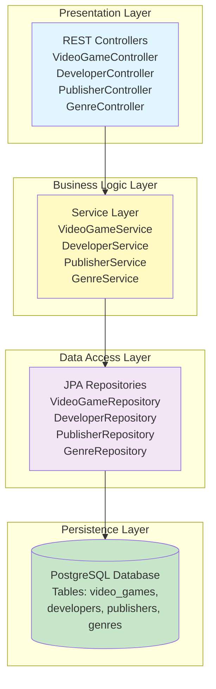

# Lab2 Feature Design: Database Integration with PostgreSQL

## Overview

Данный документ описывает дизайн второй лабораторной работы (Lab2), которая расширяет функциональность существующего Spring Boot приложения путем интеграции с реляционной базой данных PostgreSQL. В отличие от Lab1, где данные хранились в памяти приложения, Lab2 реализует полноценное взаимодействие с базой данных для управления сущностями предметной области "Видеоигры".

**Цели Lab2:**
- Интеграция с PostgreSQL через Spring Data JPA
- Создание связанных доменных моделей для видеоигр
- Реализация CRUD операций (Create, Read, Update, Delete) через REST API
- Обеспечение персистентности данных между перезапусками приложения

**Предметная область:** Управление каталогом видеоигр с атрибутами: название, разработчик, издатель, год выпуска, жанр и цена.

## Architecture

### System Components

Архитектура Lab2 следует классическому трехслойному подходу Spring Boot с добавлением слоя персистентности:



### Component Responsibilities

| Component | Responsibility | Key Characteristics |
|-----------|---------------|---------------------|
| **Controllers** | Обработка HTTP запросов, маршрутизация, валидация входящих данных, формирование HTTP ответов | Аннотированы @RestController, используют @RequestMapping для маршрутизации |
| **Services** | Бизнес-логика, координация операций между репозиториями, обработка транзакций | Аннотированы @Service, управляют транзакциями через @Transactional |
| **Repositories** | Абстракция доступа к данным, выполнение SQL операций через JPA | Наследуют JpaRepository, предоставляют методы CRUD и пользовательские запросы |
| **Entities** | Представление доменных моделей, маппинг на таблицы БД | Аннотированы @Entity, содержат JPA аннотации для связей и ограничений |
| **PostgreSQL** | Хранение данных, обеспечение целостности данных, выполнение SQL запросов | Реляционная БД с поддержкой ACID транзакций |

### Data Flow Architecture

Поток данных для типичной CRUD операции:

```
sequenceDiagram
    participant Client as HTTP Client
    participant Controller as VideoGameController
    participant Service as VideoGameService
    participant Repository as VideoGameRepository
    participant DB as PostgreSQL

    rect rgb(200, 230, 255)
        Note over Client,DB: CREATE Operation Flow
        Client->>Controller: POST /lab2/videogames<br/>{название, разработчик, издатель,...}
        Controller->>Controller: Validate request
        Controller->>Service: createVideoGame(dto)
        Service->>Service: Check business rules
        Service->>Repository: save(entity)
        Repository->>DB: INSERT INTO video_games...
        DB-->>Repository: Generated ID
        Repository-->>Service: Saved entity
        Service-->>Controller: Game entity
        Controller-->>Client: 201 Created + Location header
    end

    rect rgb(200, 255, 230)
        Note over Client,DB: READ Operation Flow
        Client->>Controller: GET /lab2/videogames/{id}
        Controller->>Service: getVideoGameById(id)
        Service->>Repository: findById(id)
        Repository->>DB: SELECT * FROM video_games WHERE id=?
        DB-->>Repository: Result set
        Repository-->>Service: Optional<VideoGame>
        Service-->>Controller: VideoGame or throw exception
        Controller-->>Client: 200 OK + Game data
    end

    rect rgb(255, 230, 200)
        Note over Client,DB: UPDATE Operation Flow
        Client->>Controller: PUT /lab2/videogames/{id}<br/>{updated fields}
        Controller->>Service: updateVideoGame(id, dto)
        Service->>Repository: findById(id)
        Repository->>DB: SELECT...
        Service->>Service: Merge changes
        Service->>Repository: save(updatedEntity)
        Repository->>DB: UPDATE video_games SET...
        DB-->>Repository: Rows affected
        Repository-->>Service: Updated entity
        Service-->>Controller: Updated game
        Controller-->>Client: 200 OK + Updated data
    end

    rect rgb(255, 200, 200)
        Note over Client,DB: DELETE Operation Flow
        Client->>Controller: DELETE /lab2/videogames/{id}
        Controller->>Service: deleteVideoGame(id)
        Service->>Repository: existsById(id)
        Repository->>DB: SELECT EXISTS...
        Service->>Repository: deleteById(id)
        Repository->>DB: DELETE FROM video_games WHERE id=?
        DB-->>Repository: Rows deleted
        Repository-->>Service: Void
        Service-->>Controller: Confirmation
        Controller-->>Client: 204 No Content
    end
```

## Data Models & Relationships

### Entity Relationship Diagram

```
erDiagram
    VIDEO_GAME ||--o{ DEVELOPER : "developed_by"
    VIDEO_GAME ||--o{ PUBLISHER : "published_by"
    VIDEO_GAME ||--o{ GENRE : "belongs_to"
    
    VIDEO_GAME {
        bigint id PK "Primary Key, Auto-generated"
        varchar(255) title "Game title, NOT NULL"
        integer release_year "Year of release, 1970-2100"
        decimal(10_2) price "Price in USD, >= 0"
        bigint developer_id FK "Foreign Key to DEVELOPER"
        bigint publisher_id FK "Foreign Key to PUBLISHER"
        bigint genre_id FK "Foreign Key to GENRE"
        timestamp created_at "Creation timestamp"
        timestamp updated_at "Last update timestamp"
    }
    
    DEVELOPER {
        bigint id PK "Primary Key, Auto-generated"
        varchar(255) name "Developer name, UNIQUE, NOT NULL"
        varchar(100) country "Country of origin"
        integer founded_year "Year founded"
    }
    
    PUBLISHER {
        bigint id PK "Primary Key, Auto-generated"
        varchar(255) name "Publisher name, UNIQUE, NOT NULL"
        varchar(100) country "Country of origin"
        integer founded_year "Year founded"
    }
    
    GENRE {
        bigint id PK "Primary Key, Auto-generated"
        varchar(100) name "Genre name, UNIQUE, NOT NULL"
        text description "Genre description"
    }
```

### Entity Definitions

#### VideoGame Entity

**Назначение:** Центральная сущность, представляющая видеоигру в системе.

| Attribute | Type | Constraints | Description |
|-----------|------|-------------|-------------|
| id | Long | PK, Auto-increment | Уникальный идентификатор игры |
| title | String | NOT NULL, max 255 chars | Название игры |
| releaseYear | Integer | Range: 1970-2100 | Год выпуска игры |
| price | BigDecimal | >= 0, precision(10,2) | Цена в долларах США |
| developer | Developer | FK, ManyToOne | Ссылка на разработчика |
| publisher | Publisher | FK, ManyToOne | Ссылка на издателя |
| genre | Genre | FK, ManyToOne | Ссылка на жанр |
| createdAt | LocalDateTime | Auto-generated | Время создания записи |
| updatedAt | LocalDateTime | Auto-updated | Время последнего обновления |

**Связи:**
- ManyToOne с Developer (многие игры могут быть разработаны одним разработчиком)
- ManyToOne с Publisher (многие игры могут быть изданы одним издателем)
- ManyToOne с Genre (многие игры могут принадлежать одному жанру)

#### Developer Entity

**Назначение:** Представляет компанию-разработчика видеоигр.

| Attribute | Type | Constraints | Description |
|-----------|------|-------------|-------------|
| id | Long | PK, Auto-increment | Уникальный идентификатор разработчика |
| name | String | UNIQUE, NOT NULL, max 255 | Название компании-разработчика |
| country | String | max 100 chars | Страна происхождения |
| foundedYear | Integer | Nullable | Год основания компании |

**Связи:**
- OneToMany с VideoGame (один разработчик может создать много игр)

#### Publisher Entity

**Назначение:** Представляет компанию-издателя видеоигр.

| Attribute | Type | Constraints | Description |
|-----------|------|-------------|-------------|
| id | Long | PK, Auto-increment | Уникальный идентификатор издателя |
| name | String | UNIQUE, NOT NULL, max 255 | Название компании-издателя |
| country | String | max 100 chars | Страна происхождения |
| foundedYear | Integer | Nullable | Год основания компании |

**Связи:**
- OneToMany с VideoGame (один издатель может издать много игр)

#### Genre Entity

**Назначение:** Представляет игровой жанр (RPG, FPS, Strategy и т.д.).

| Attribute | Type | Constraints | Description |
|-----------|------|-------------|-------------|
| id | Long | PK, Auto-increment | Уникальный идентификатор жанра |
| name | String | UNIQUE, NOT NULL, max 100 | Название жанра |
| description | String | TEXT, Nullable | Описание жанра |

**Связи:**
- OneToMany с VideoGame (один жанр может включать много игр)

### Database Schema Strategy

**Стратегия именования таблиц:**
- Таблицы именуются в snake_case: `video_games`, `developers`, `publishers`, `genres`
- Колонки также используют snake_case: `release_year`, `created_at`

**Стратегия индексации:**
- Primary keys автоматически индексируются
- Foreign keys должны иметь индексы для оптимизации JOIN операций
- Уникальные поля (name в Developer, Publisher, Genre) автоматически получают UNIQUE индексы
- Рекомендуется добавить индекс на `video_games.title` для быстрого поиска по названию

**Стратегия каскадирования:**
- При удалении Developer/Publisher/Genre связанные VideoGame записи НЕ удаляются (защита данных)
- Вместо каскадного удаления используется проверка наличия связанных записей перед удалением справочных сущностей

## API Endpoints Reference

### VideoGame Endpoints

Базовый путь: `/lab2/videogames`

#### Create Video Game

**Endpoint:** `POST /lab2/videogames`

**Описание:** Создает новую запись видеоигры в базе данных.

**Request Body:**
```
{
  "title": string (required, max 255 chars),
  "releaseYear": integer (required, 1970-2100),
  "price": decimal (required, >= 0),
  "developerId": long (required, must exist),
  "publisherId": long (required, must exist),
  "genreId": long (required, must exist)
}
```

**Response:**
- **201 Created** - Игра успешно создана
  ```
  {
    "id": long,
    "title": string,
    "releaseYear": integer,
    "price": decimal,
    "developer": {
      "id": long,
      "name": string,
      "country": string,
      "foundedYear": integer
    },
    "publisher": { ... },
    "genre": { ... },
    "createdAt": timestamp,
    "updatedAt": timestamp
  }
  ```
  Location header: `/lab2/videogames/{id}`

- **400 Bad Request** - Невалидные входные данные (missing fields, invalid ranges)
- **404 Not Found** - Developer/Publisher/Genre с указанным ID не существует

#### Get All Video Games

**Endpoint:** `GET /lab2/videogames`

**Описание:** Получает список всех видеоигр с возможностью фильтрации.

**Query Parameters:**

| Parameter | Type | Required | Description |
|-----------|------|----------|-------------|
| genreId | Long | No | Фильтр по ID жанра |
| developerId | Long | No | Фильтр по ID разработчика |
| publisherId | Long | No | Фильтр по ID издателя |
| minPrice | Decimal | No | Минимальная цена |
| maxPrice | Decimal | No | Максимальная цена |
| releaseYear | Integer | No | Фильтр по году выпуска |

**Response:**
- **200 OK**
  ```
  {
    "games": [
      {
        "id": long,
        "title": string,
        "releaseYear": integer,
        "price": decimal,
        "developer": { ... },
        "publisher": { ... },
        "genre": { ... }
      }
    ],
    "count": integer
  }
  ```

#### Get Video Game by ID

**Endpoint:** `GET /lab2/videogames/{id}`

**Описание:** Получает детальную информацию об игре по её ID.

**Path Parameters:**
- `id` - Long, уникальный идентификатор игры

**Response:**
- **200 OK** - Игра найдена (структура как в Create)
- **404 Not Found** - Игра с указанным ID не существует

#### Update Video Game

**Endpoint:** `PUT /lab2/videogames/{id}`

**Описание:** Обновляет существующую запись видеоигры. Все поля обязательны (полное обновление).

**Path Parameters:**
- `id` - Long, идентификатор игры для обновления

**Request Body:** (та же структура что и при создании)

**Response:**
- **200 OK** - Игра успешно обновлена (возвращает обновленную сущность)
- **400 Bad Request** - Невалидные данные
- **404 Not Found** - Игра или связанные сущности не найдены

#### Partial Update Video Game

**Endpoint:** `PATCH /lab2/videogames/{id}`

**Описание:** Частичное обновление игры (обновляются только переданные поля).

**Request Body:** (все поля опциональны)
```
{
  "title": string (optional),
  "releaseYear": integer (optional),
  "price": decimal (optional),
  "developerId": long (optional),
  "publisherId": long (optional),
  "genreId": long (optional)
}
```

**Response:**
- **200 OK** - Успешное частичное обновление
- **400 Bad Request** - Невалидные данные
- **404 Not Found** - Игра не найдена

#### Delete Video Game

**Endpoint:** `DELETE /lab2/videogames/{id}`

**Описание:** Удаляет игру из базы данных.

**Path Parameters:**
- `id` - Long, идентификатор игры для удаления

**Response:**
- **204 No Content** - Игра успешно удалена
- **404 Not Found** - Игра с указанным ID не существует

### Developer Endpoints

Базовый путь: `/lab2/developers`

#### Create Developer

**Endpoint:** `POST /lab2/developers`

**Request Body:**
```
{
  "name": string (required, unique, max 255),
  "country": string (optional, max 100),
  "foundedYear": integer (optional)
}
```

**Response:**
- **201 Created** - Разработчик создан
- **400 Bad Request** - Невалидные данные
- **409 Conflict** - Разработчик с таким именем уже существует

#### Get All Developers

**Endpoint:** `GET /lab2/developers`

**Response:**
- **200 OK**
  ```
  {
    "developers": [
      {
        "id": long,
        "name": string,
        "country": string,
        "foundedYear": integer,
        "gamesCount": integer (количество игр этого разработчика)
      }
    ],
    "count": integer
  }
  ```

#### Get Developer by ID

**Endpoint:** `GET /lab2/developers/{id}`

**Response:**
- **200 OK** - Детали разработчика включая список игр
- **404 Not Found** - Разработчик не найден

#### Update Developer

**Endpoint:** `PUT /lab2/developers/{id}`

**Request Body:** (как при создании)

**Response:**
- **200 OK** - Обновлен
- **400 Bad Request** - Невалидные данные
- **404 Not Found** - Не найден
- **409 Conflict** - Имя уже занято

#### Delete Developer

**Endpoint:** `DELETE /lab2/developers/{id}`

**Response:**
- **204 No Content** - Удален
- **404 Not Found** - Не найден
- **409 Conflict** - Невозможно удалить, есть связанные игры

### Publisher Endpoints

Базовый путь: `/lab2/publishers`

Структура эндпоинтов аналогична Developer endpoints:
- `POST /lab2/publishers` - создание
- `GET /lab2/publishers` - список всех
- `GET /lab2/publishers/{id}` - получение по ID
- `PUT /lab2/publishers/{id}` - обновление
- `DELETE /lab2/publishers/{id}` - удаление

Формат запросов и ответов идентичен Developer API.

### Genre Endpoints

Базовый путь: `/lab2/genres`

#### Create Genre

**Endpoint:** `POST /lab2/genres`

**Request Body:**
```
{
  "name": string (required, unique, max 100),
  "description": string (optional, TEXT)
}
```

**Response:**
- **201 Created**
- **400 Bad Request**
- **409 Conflict** - Жанр с таким именем существует

#### Get All Genres

**Endpoint:** `GET /lab2/genres`

**Response:**
- **200 OK**
  ```
  {
    "genres": [
      {
        "id": long,
        "name": string,
        "description": string,
        "gamesCount": integer
      }
    ],
    "count": integer
  }
  ```

#### Get Genre by ID

**Endpoint:** `GET /lab2/genres/{id}`

**Response:**
- **200 OK** - Детали жанра включая игры этого жанра
- **404 Not Found**

#### Update Genre

**Endpoint:** `PUT /lab2/genres/{id}`

**Response:**
- **200 OK**
- **400 Bad Request**
- **404 Not Found**
- **409 Conflict**

#### Delete Genre

**Endpoint:** `DELETE /lab2/genres/{id}`

**Response:**
- **204 No Content**
- **404 Not Found**
- **409 Conflict** - Невозможно удалить, есть игры этого жанра

## Service Layer Architecture

### VideoGameService

**Назначение:** Управление бизнес-логикой для операций с видеоиграми.

**Ключевые методы:**

| Method | Purpose | Transaction | Validation Rules |
|--------|---------|-------------|------------------|
| createVideoGame(dto) | Создание новой игры | Required | - Title не пустой<br>- Release year в диапазоне 1970-2100<br>- Price >= 0<br>- Developer/Publisher/Genre существуют |
| getAllVideoGames(filters) | Получение списка игр с фильтрацией | ReadOnly | - Фильтры валидны<br>- Числовые диапазоны корректны |
| getVideoGameById(id) | Получение игры по ID | ReadOnly | - ID положительный |
| updateVideoGame(id, dto) | Полное обновление игры | Required | - Игра существует<br>- Все правила создания<br>- Новые связанные сущности существуют |
| patchVideoGame(id, dto) | Частичное обновление | Required | - Игра существует<br>- Переданные поля валидны |
| deleteVideoGame(id) | Удаление игры | Required | - Игра существует |

**Бизнес-правила:**
1. Нельзя создать игру с датой выпуска в будущем (releaseYear > текущий год + 2)
2. При изменении цены проверяется, что она не отрицательная
3. При обновлении проверяется существование всех связанных сущностей
4. Автоматическое обновление поля `updatedAt` при любом изменении

### DeveloperService

**Ключевые методы:**

| Method | Purpose | Validation |
|--------|---------|------------|
| createDeveloper(dto) | Создание разработчика | - Name уникален и не пустой<br>- Founded year разумен (> 1950) |
| getAllDevelopers() | Получение всех разработчиков | Нет |
| getDeveloperById(id) | Получение по ID с играми | - ID существует |
| updateDeveloper(id, dto) | Обновление | - Существует<br>- Новое имя уникально |
| deleteDeveloper(id) | Удаление | - Существует<br>- Нет связанных игр |

**Бизнес-правила:**
- При попытке удалить разработчика, имеющего игры, возвращается ошибка с предложением удалить/переназначить игры
- При получении разработчика вычисляется количество его игр

### PublisherService

Структура и методы аналогичны DeveloperService с теми же бизнес-правилами.

### GenreService

**Ключевые методы:** аналогичны DeveloperService

**Бизнес-правила:**
- Жанры с играми нельзя удалять
- Имена жанров нормализуются (capitalize first letter)
- При получении жанра включается статистика игр (количество, средняя цена)

## Repository Layer

### Repository Interfaces

Все репозитории расширяют `JpaRepository<Entity, Long>` и получают стандартные CRUD методы:

#### VideoGameRepository

**Стандартные методы (унаследованные):**
- `save(entity)` - сохранение/обновление
- `findById(id)` - поиск по ID
- `findAll()` - получение всех
- `deleteById(id)` - удаление по ID
- `existsById(id)` - проверка существования

**Пользовательские query методы:**

| Method Signature | Purpose | Query Strategy |
|------------------|---------|----------------|
| findByGenreId(Long genreId) | Поиск игр по жанру | Derived query |
| findByDeveloperId(Long devId) | Поиск игр по разработчику | Derived query |
| findByPublisherId(Long pubId) | Поиск игр по издателю | Derived query |
| findByReleaseYear(Integer year) | Поиск игр по году | Derived query |
| findByPriceBetween(BigDecimal min, BigDecimal max) | Поиск по диапазону цен | Derived query |
| findByTitleContainingIgnoreCase(String title) | Поиск по части названия | Derived query |

#### DeveloperRepository

**Пользовательские методы:**
- `findByName(String name)` - поиск по имени (для проверки уникальности)
- `existsByName(String name)` - проверка существования по имени

#### PublisherRepository

Аналогичен DeveloperRepository:
- `findByName(String name)`
- `existsByName(String name)`

#### GenreRepository

**Пользовательские методы:**
- `findByName(String name)`
- `existsByName(String name)`

## Database Configuration

### Spring Data JPA Configuration

**Конфигурационные параметры для application.properties:**

| Parameter | Value | Purpose |
|-----------|-------|---------|
| spring.datasource.url | jdbc:postgresql://localhost:5432/lab2_videogames | URL подключения к PostgreSQL БД |
| spring.datasource.username | postgres | Имя пользователя БД |
| spring.datasource.password | postgres | Пароль БД |
| spring.datasource.driver-class-name | org.postgresql.Driver | JDBC драйвер PostgreSQL |
| spring.jpa.database-platform | org.hibernate.dialect.PostgreSQLDialect | Диалект SQL для PostgreSQL |
| spring.jpa.hibernate.ddl-auto | update | Автоматическое обновление схемы БД при старте |
| spring.jpa.show-sql | true | Логирование SQL запросов |
| spring.jpa.properties.hibernate.format_sql | true | Форматирование SQL в логах |

### Database Initialization Strategy

**Стратегия:**
1. При первом запуске Hibernate создаст таблицы автоматически (ddl-auto=update)
2. Опционально: предоставить SQL скрипты для заполнения справочников (data.sql)

**Начальные данные (seed data):**
- Создать 5-10 популярных жанров: Action, RPG, Strategy, Adventure, Simulation, Sports, Racing, Puzzle, FPS, MMORPG
- Создать 5-7 известных разработчиков: CD Projekt Red, Bethesda, Rockstar Games, Valve, Epic Games
- Создать 5-7 издателей: Electronic Arts, Activision, Ubisoft, Sony, Microsoft

## Testing Strategy

### Unit Testing

**Scope:** Тестирование Service слоя изолированно от БД

**Подход:**
- Использование Mockito для моков Repository
- Тестирование бизнес-логики и валидаций
- Проверка вызовов методов репозиториев

**Примерные тест-кейсы для VideoGameService:**

| Test Case | Scenario | Expected Result |
|-----------|----------|-----------------|
| testCreateVideoGame_Success | Создание игры с валидными данными | Вызывается repository.save(), возвращается сохраненная сущность |
| testCreateVideoGame_InvalidPrice | Попытка создать игру с ценой < 0 | Выбрасывается ValidationException |
| testGetVideoGameById_NotFound | Запрос игры с несуществующим ID | Выбрасывается VideoGameNotFoundException |
| testDeleteVideoGame_Success | Удаление существующей игры | Вызывается repository.deleteById() |
| testUpdateVideoGame_PartialUpdate | PATCH с обновлением только цены | Обновляется только price, остальные поля неизменны |

### Integration Testing

**Scope:** Тестирование взаимодействия с реальной БД

**Подход:**
- Использование @DataJpaTest для Repository тестов
- TestContainers для запуска PostgreSQL в Docker контейнере (опционально)
- Тестирование custom query методов

**Примерные тест-кейсы для VideoGameRepository:**

| Test Case | Scenario | Verification |
|-----------|----------|--------------||
| testFindByGenreId | Сохранение игр разных жанров, запрос по genreId | Возвращаются только игры нужного жанра |
| testFindByPriceBetween | Запрос игр в диапазоне цен 10-50 | Все результаты имеют цену в диапазоне |
| testSaveCascade | Сохранение игры с существующим Developer | Создается только VideoGame, Developer не дублируется |

## Exception Handling Strategy

### Exception Types

| Exception Type | HTTP Status | When Thrown | Response Format |
|----------------|-------------|-------------|-----------------||
| ResourceNotFoundException | 404 Not Found | Запрошенная сущность не найдена по ID | `{"error": "Not Found", "message": "VideoGame with id 123 not found", "timestamp": "..."}` |
| ValidationException | 400 Bad Request | Невалидные входные данные (цена < 0, пустое название) | `{"error": "Bad Request", "message": "Price must be non-negative", "field": "price"}` |
| ConflictException | 409 Conflict | Нарушение уникальности или попытка удалить сущность со связями | `{"error": "Conflict", "message": "Developer already exists"}` |
| DatabaseException | 500 Internal Server Error | Непредвиденные ошибки БД | `{"error": "Internal Server Error", "message": "Database connection failed"}` |

**Механизм обработки:** Глобальный @RestControllerAdvice с @ExceptionHandler методами для перехвата исключений на уровне контроллеров и преобразования в стандартизированный JSON response.

## Technology Stack & Dependencies

### Required Dependencies (build.gradle)

| Dependency | Purpose | Version |
|------------|---------|---------||
| spring-boot-starter-data-jpa | JPA/Hibernate интеграция | Managed by Spring Boot BOM |
| spring-boot-starter-web | REST API framework | Managed by Spring Boot BOM |
| postgresql | PostgreSQL JDBC драйвер | Latest compatible |
| spring-boot-starter-validation | Bean validation (Jakarta) | Managed by Spring Boot BOM |
| kotlin-reflect | Kotlin reflection для JPA | Managed by Kotlin plugin |
| jackson-module-kotlin | JSON сериализация Kotlin классов | Managed by Spring Boot BOM |

**Опциональные зависимости:**
- `spring-boot-devtools` - Hot reload during development (только для dev profile)
- `h2database` - In-memory БД для тестов (для integration tests)

## Project Structure

**Структура папок Lab2:**

```
src/main/kotlin/com/example/demo/
└── Lab2/
    ├── controllers/
    │   ├── VideoGameController.kt
    │   ├── DeveloperController.kt
    │   ├── PublisherController.kt
    │   └── GenreController.kt
    ├── services/
    │   ├── VideoGameService.kt
    │   ├── DeveloperService.kt
    │   ├── PublisherService.kt
    │   └── GenreService.kt
    ├── repositories/
    │   ├── VideoGameRepository.kt
    │   ├── DeveloperRepository.kt
    │   ├── PublisherRepository.kt
    │   └── GenreRepository.kt
    ├── entities/
    │   ├── VideoGame.kt
    │   ├── Developer.kt
    │   ├── Publisher.kt
    │   └── Genre.kt
    ├── dto/
    │   ├── VideoGameDTO.kt
    │   ├── DeveloperDTO.kt
    │   ├── PublisherDTO.kt
    │   └── GenreDTO.kt
    └── exceptions/
        ├── VideoGameException.kt
        ├── ResourceNotFoundException.kt
        ├── ValidationException.kt
        └── ConflictException.kt

src/test/kotlin/com/example/demo/Lab2/
├── services/
│   └── VideoGameServiceTest.kt
└── repositories/
    └── VideoGameRepositoryTest.kt
```

**Соглашения о размещении:**
- **entities/** - JPA сущности с аннотациями @Entity
- **dto/** - Data Transfer Objects для API запросов/ответов
- **repositories/** - Интерфейсы репозиториев, расширяющие JpaRepository
- **services/** - Бизнес-логика, аннотированные @Service
- **controllers/** - REST контроллеры, аннотированные @RestController
- **exceptions/** - Кастомные исключения для обработки ошибок

## Migration from Lab1

### Key Differences

| Aspect | Lab1 | Lab2 |
|--------|------|------||
| Data Storage | In-memory (переменные в контроллерах) | PostgreSQL database |
| Data Lifetime | Теряется при перезапуске | Персистентна |
| Data Complexity | Примитивы и коллекции примитивов | Связанные объекты с FK |
| Query Capabilities | Нет | SQL запросы, фильтрация |
| Concurrency | Не thread-safe | ACID транзакции |
| Architecture | 2-layer (Controller + Model) | 4-layer (Controller + Service + Repository + Entity) |

### Reusable Patterns from Lab1

1. **Структура пакетов:** Lab2 следует той же структуре папок (Lab2/controllers, Lab2/models)
2. **Маршрутизация:** Используется `/lab2/*` как базовый путь (аналогично `/lab1/*`)
3. **Response structure:** Сохраняется формат ответов с полями message, data, count
4. **Naming conventions:** Русские комментарии, английские имена переменных/классов
