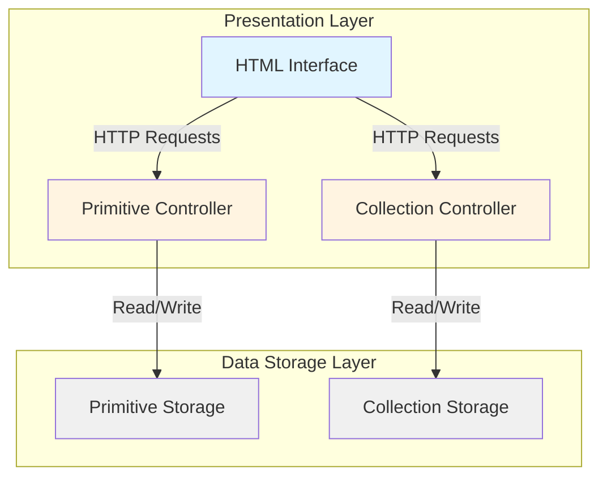
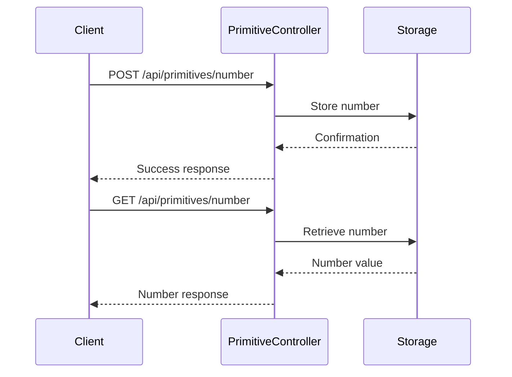
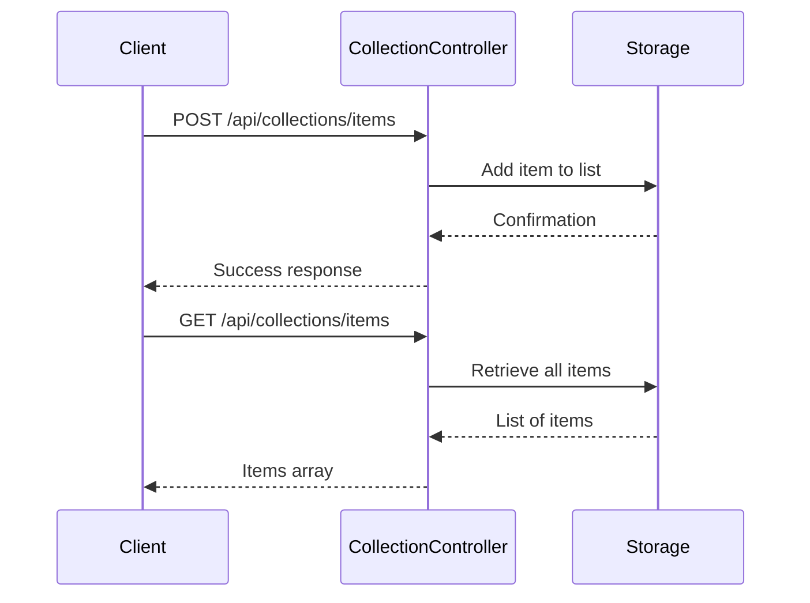
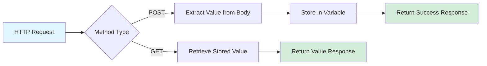
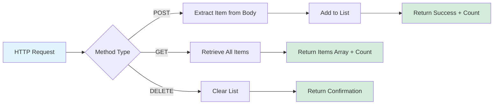
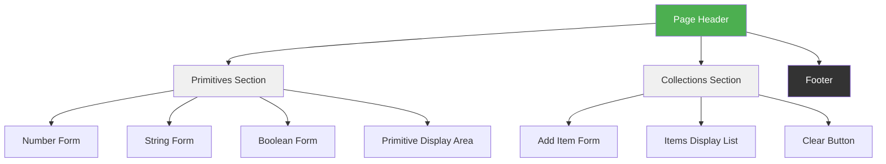
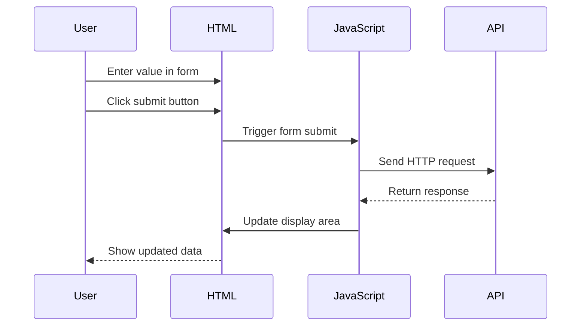
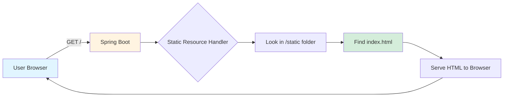
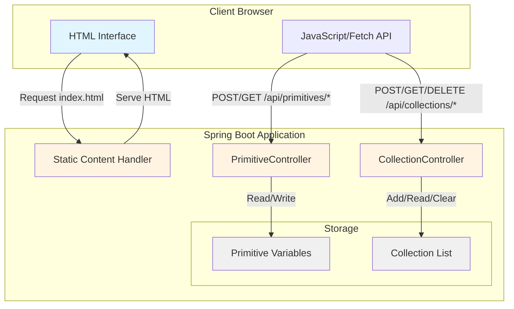

# Microservice with REST Controllers

## Overview

This design describes a Spring Boot microservice that provides REST API endpoints for managing primitive data types and collections. The service follows the KISS (Keep It Simple, Stupid) principle, focusing on straightforward implementations without unnecessary complexity. The microservice includes a web interface for interacting with the API endpoints.

### Purpose
- Provide simple REST endpoints for adding and retrieving primitive values (numbers, strings, booleans)
- Provide REST endpoints for managing collections (lists of items)
- Offer a user-friendly HTML interface for testing and interacting with the endpoints
- Demonstrate basic Spring Boot REST controller patterns in an easy-to-understand manner

### Repository Type
Backend Application (Spring Boot REST API with Web UI)

## Architecture

The application follows a simple three-layer architecture suitable for educational purposes:



### Architecture Layers

| Layer | Components | Responsibility |
|-------|-----------|----------------|
| **Presentation** | HTML Interface | Provides user interface with forms and displays for interacting with API |
| **Controller** | PrimitiveController, CollectionController | Handle HTTP requests, validate input, return responses |
| **Storage** | In-memory data structures | Store primitives and collections temporarily during runtime |

### Design Principles (KISS)

The architecture adheres to the KISS principle by:
- Using simple in-memory storage instead of databases
- Avoiding complex service layers or business logic
- Using straightforward REST endpoints with minimal parameters
- Keeping controllers focused on single responsibilities
- No authentication or authorization complexity
- Direct data manipulation without ORM frameworks

## API Endpoints Reference

### Primitive Controller Endpoints

The Primitive Controller manages basic data types: integers, strings, and booleans.



#### Add Number Endpoint

| Property | Value |
|----------|-------|
| **HTTP Method** | POST |
| **Path** | `/api/primitives/number` |
| **Purpose** | Store a numeric value |
| **Request Body** | JSON with number field |
| **Response** | Confirmation message |

**Request Schema:**
```
{
  "value": <number>
}
```

**Response Schema:**
```
{
  "message": "Number added successfully",
  "value": <number>
}
```

#### Get Number Endpoint

| Property | Value |
|----------|-------|
| **HTTP Method** | GET |
| **Path** | `/api/primitives/number` |
| **Purpose** | Retrieve the stored numeric value |
| **Response** | Number value or null if not set |

**Response Schema:**
```
{
  "value": <number or null>
}
```

#### Add String Endpoint

| Property | Value |
|----------|-------|
| **HTTP Method** | POST |
| **Path** | `/api/primitives/string` |
| **Purpose** | Store a text value |
| **Request Body** | JSON with string field |
| **Response** | Confirmation message |

**Request Schema:**
```
{
  "value": "<text>"
}
```

**Response Schema:**
```
{
  "message": "String added successfully",
  "value": "<text>"
}
```

#### Get String Endpoint

| Property | Value |
|----------|-------|
| **HTTP Method** | GET |
| **Path** | `/api/primitives/string` |
| **Purpose** | Retrieve the stored text value |
| **Response** | String value or null if not set |

**Response Schema:**
```
{
  "value": "<text or null>"
}
```

#### Add Boolean Endpoint

| Property | Value |
|----------|-------|
| **HTTP Method** | POST |
| **Path** | `/api/primitives/boolean` |
| **Purpose** | Store a true/false value |
| **Request Body** | JSON with boolean field |
| **Response** | Confirmation message |

**Request Schema:**
```
{
  "value": <true or false>
}
```

**Response Schema:**
```
{
  "message": "Boolean added successfully",
  "value": <true or false>
}
```

#### Get Boolean Endpoint

| Property | Value |
|----------|-------|
| **HTTP Method** | GET |
| **Path** | `/api/primitives/boolean` |
| **Purpose** | Retrieve the stored boolean value |
| **Response** | Boolean value or null if not set |

**Response Schema:**
```
{
  "value": <true, false, or null>
}
```

### Collection Controller Endpoints

The Collection Controller manages lists of string items.



#### Add Item to Collection Endpoint

| Property | Value |
|----------|-------|
| **HTTP Method** | POST |
| **Path** | `/api/collections/items` |
| **Purpose** | Add a new item to the collection |
| **Request Body** | JSON with item field |
| **Response** | Confirmation message |

**Request Schema:**
```
{
  "item": "<text>"
}
```

**Response Schema:**
```
{
  "message": "Item added successfully",
  "item": "<text>",
  "totalItems": <number>
}
```

#### Get All Items Endpoint

| Property | Value |
|----------|-------|
| **HTTP Method** | GET |
| **Path** | `/api/collections/items` |
| **Purpose** | Retrieve all items in the collection |
| **Response** | Array of items |

**Response Schema:**
```
{
  "items": ["<item1>", "<item2>", ...],
  "count": <number>
}
```

#### Clear Collection Endpoint

| Property | Value |
|----------|-------|
| **HTTP Method** | DELETE |
| **Path** | `/api/collections/items` |
| **Purpose** | Remove all items from the collection |
| **Response** | Confirmation message |

**Response Schema:**
```
{
  "message": "Collection cleared successfully"
}
```

## Data Models

### Primitive Data Model

The primitive storage holds single values for each data type:

| Field Name | Data Type | Description | Default Value |
|-----------|-----------|-------------|---------------|
| storedNumber | Integer (nullable) | Stores a numeric value | null |
| storedString | String (nullable) | Stores a text value | null |
| storedBoolean | Boolean (nullable) | Stores a true/false value | null |

**Characteristics:**
- Only one value per type can be stored at a time
- New values overwrite previous values
- Values persist only during application runtime
- All values start as null when application launches

### Collection Data Model

The collection storage maintains a list of string items:

| Field Name | Data Type | Description | Default Value |
|-----------|-----------|-------------|---------------|
| items | List of Strings | Stores multiple text items | Empty list |

**Characteristics:**
- Can store unlimited items (limited by memory)
- Items are added to the end of the list
- Duplicate items are allowed
- Order of items is preserved
- List persists only during application runtime
- List starts empty when application launches

### Request/Response Models

#### Number Request
| Field | Type | Required | Description |
|-------|------|----------|-------------|
| value | Number | Yes | Numeric value to store |

#### String Request
| Field | Type | Required | Description |
|-------|------|----------|-------------|
| value | String | Yes | Text value to store |

#### Boolean Request
| Field | Type | Required | Description |
|-------|------|----------|-------------|
| value | Boolean | Yes | True or false value to store |

#### Item Request
| Field | Type | Required | Description |
|-------|------|----------|-------------|
| item | String | Yes | Text item to add to collection |

## Controller Architecture

### PrimitiveController

**Purpose:** Manages storage and retrieval of primitive data types

**Responsibilities:**
- Accept POST requests with primitive values
- Store values in memory
- Return stored values on GET requests
- Provide appropriate HTTP status codes
- Return JSON responses

**Endpoints Handled:**
- POST `/api/primitives/number`
- GET `/api/primitives/number`
- POST `/api/primitives/string`
- GET `/api/primitives/string`
- POST `/api/primitives/boolean`
- GET `/api/primitives/boolean`

**Data Flow:**


### CollectionController

**Purpose:** Manages a collection of string items

**Responsibilities:**
- Accept POST requests to add items
- Maintain a list of items
- Return all items on GET requests
- Clear collection on DELETE requests
- Track collection size

**Endpoints Handled:**
- POST `/api/collections/items`
- GET `/api/collections/items`
- DELETE `/api/collections/items`

**Data Flow:**


## Web Interface Design

### HTML Page Structure

The web interface provides a simple, user-friendly way to interact with both controllers.

**Page Sections:**

| Section | Purpose | Components |
|---------|---------|------------|
| Header | Display application title | Heading with styled text |
| Primitives Section | Interact with primitive endpoints | Forms for number, string, boolean; Display area |
| Collections Section | Interact with collection endpoints | Form to add items; Display list; Clear button |
| Footer | Basic information | Credits or instructions |

### Page Layout Flow



### Styling Strategy

The HTML page uses embedded CSS for simplicity (KISS principle):

**Visual Design Goals:**
- Clean and modern appearance
- Clear separation between sections
- Easy-to-read typography
- Responsive button styles
- Visual feedback for user actions

**Color Scheme:**

| Element | Color | Purpose |
|---------|-------|---------|
| Header Background | Green (#4CAF50) | Positive, welcoming tone |
| Primary Buttons | Blue (#007bff) | Standard action buttons |
| Success Messages | Light Green | Positive feedback |
| Section Backgrounds | Light Gray (#f5f5f5) | Visual separation |
| Text | Dark Gray (#333) | Readability |

**Component Styling:**

| Component | Style Characteristics |
|-----------|----------------------|
| Input Fields | Bordered, padded, full-width within containers |
| Buttons | Rounded corners, padding, hover effects |
| Sections | Bordered cards with shadow, margin spacing |
| Lists | Clean, simple list style with spacing |
| Forms | Vertical layout with labeled fields |

### User Interaction Flow



### Primitive Section Features

**Number Input:**
- Input field for numeric values
- Button to submit number
- Display area showing current stored number
- Button to retrieve/refresh current number

**String Input:**
- Text input field
- Button to submit string
- Display area showing current stored string
- Button to retrieve/refresh current string

**Boolean Input:**
- Dropdown or radio buttons for true/false selection
- Button to submit boolean
- Display area showing current stored boolean
- Button to retrieve/refresh current boolean

### Collection Section Features

**Add Item:**
- Text input field for new item
- Button to add item to collection
- Confirmation message after adding

**View Items:**
- Display list of all items in collection
- Show total count of items
- Button to refresh list

**Clear Collection:**
- Button to remove all items
- Confirmation message after clearing

## Static Resource Configuration

### HTML File Location

| Property | Value |
|----------|-------|
| Directory | `src/main/resources/static/` |
| File Name | `index.html` |
| Access URL | `http://localhost:8080/` or `http://localhost:8080/index.html` |
| Content Type | HTML with embedded CSS and JavaScript |

### Resource Serving Strategy

Spring Boot automatically serves static content from the `static` folder in the resources directory. When a user navigates to the root URL, Spring Boot serves the `index.html` file by default.

**Static Resource Flow:**


## Application Configuration

### Server Configuration

| Property | Value | Description |
|----------|-------|-------------|
| Server Port | 8080 (default) | Port where application listens |
| Context Path | / | Root path for all endpoints |
| Application Name | demo | Identifier for the service |

### CORS Configuration

For the HTML interface to communicate with REST endpoints from the same origin, no special CORS configuration is needed. Both the static HTML and API endpoints are served from the same domain and port.

## Technical Architecture Details

### Controller Implementation Pattern

Both controllers follow the same structural pattern:

**Pattern Elements:**
- Class annotated with `@RestController`
- In-memory storage as class properties
- Methods annotated with HTTP method annotations
- Request body parameters annotated with `@RequestBody`
- Return types as data classes or maps for JSON serialization

### Data Storage Strategy

**In-Memory Storage Rationale:**
- Simplicity (KISS principle)
- No database setup required
- Fast read/write operations
- Suitable for learning and demonstration
- No persistence needed for this use case

**Limitations:**
- Data lost on application restart
- Not suitable for production use
- No concurrent access control
- Limited to single instance deployment

### JSON Serialization

Spring Boot automatically handles JSON conversion:
- Request bodies are deserialized from JSON to Kotlin objects
- Response objects are serialized to JSON
- Uses Jackson library (included in spring-boot-starter-web)
- No manual JSON parsing required

## Component Interaction Overview



## Testing Strategy

### Manual Testing Approach

The application is designed for manual testing through the web interface and does not include automated unit tests as per requirements.

**Testing Methods:**

| Method | Tool | Purpose |
|--------|------|---------|
| Browser Testing | HTML Interface | Test all functionality through UI |
| Direct API Testing | curl or Postman | Test endpoints independently |
| Gradle Run | `./gradlew bootRun` | Start application for testing |

### Testing Scenarios

**Primitive Controller Testing:**
1. Add a number and verify it's stored
2. Retrieve the number and confirm correct value
3. Add a string and verify storage
4. Retrieve the string
5. Set boolean to true, then to false
6. Retrieve boolean value

**Collection Controller Testing:**
1. Add single item to empty collection
2. Add multiple items
3. Retrieve all items and verify order
4. Clear collection
5. Verify collection is empty after clearing
6. Add duplicate items and confirm allowed

**Integration Testing:**
1. Load HTML page successfully
2. Submit forms through UI
3. Verify responses display correctly
4. Test all buttons and inputs
5. Verify styling appears as expected

### Expected Behavior

**Success Criteria:**
- All endpoints return appropriate HTTP status codes
- JSON responses match documented schemas
- HTML interface loads and displays correctly
- Form submissions trigger API calls
- Response data updates UI dynamically
- No errors in browser console
- Application starts without errors using Gradle
