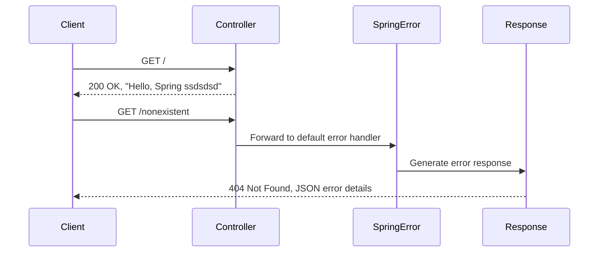

# API Endpoints Reference

<cite>
**Referenced Files in This Document**   
- [HomeController.kt](file://src\main\kotlin\com\example\demo\controllers\Controller.kt)
- [DemoApplication.kt](file://src\main\kotlin\com\example\demo\DemoApplication.kt)
- [application.properties](file://src\main\resources\application.properties)
- [build.gradle](file://build.gradle)
</cite>

## Table of Contents
1. [Introduction](#introduction)
2. [Root Endpoint Specification](#root-endpoint-specification)
3. [Implementation Details](#implementation-details)
4. [Testing the Endpoint](#testing-the-endpoint)
5. [Error Handling](#error-handling)
6. [Customization and Extension](#customization-and-extension)
7. [Troubleshooting](#troubleshooting)
8. [Security and Rate Limiting](#security-and-rate-limiting)

## Introduction
This document provides comprehensive API documentation for the root endpoint (/) in a Spring Boot application implemented in Kotlin. The endpoint serves as a basic health check and welcome message, returning a plain text response. The application follows standard Spring Boot conventions with Kotlin integration and uses annotation-based routing for HTTP request handling.

**Section sources**
- [DemoApplication.kt](file://src\main\kotlin\com\example\demo\DemoApplication.kt#L1-L12)
- [build.gradle](file://build.gradle#L1-L20)

## Root Endpoint Specification
The HomeController exposes a single GET endpoint at the root path (/). This endpoint requires no request parameters or authentication and returns a simple plain text response.

### Endpoint Details
| Attribute | Value |
|---------|-------|
| **HTTP Method** | GET |
| **URL Pattern** | / |
| **Request Parameters** | None |
| **Response Format** | text/plain |
| **Success Status** | 200 OK |
| **Response Body** | Hello, Spring ssdsdsd |

The endpoint is designed to provide a basic confirmation that the application is running and accessible. It serves as a starting point for API interaction and can be used for health checks or service discovery.

**Section sources**
- [Controller.kt](file://src\main\kotlin\com\example\demo\controllers\Controller.kt#L5-L10)

## Implementation Details
The root endpoint is implemented using Spring Boot's annotation-based controller pattern in Kotlin. The `HomeController` class is annotated with `@RestController`, which combines `@Controller` and `@ResponseBody` annotations, indicating that all handler methods return domain objects directly rather than view names.

The `home()` method is mapped to the root path using the `@GetMapping("/")` annotation, which is a specialized variant of `@RequestMapping` for HTTP GET requests. The method uses Kotlin's expression body syntax, where the function body is a single expression that is returned.

```mermaid
classDiagram
class HomeController {
+home() String
}
note right of HomeController
@RestController annotation indicates this class
handles web requests and returns data directly
end note
HomeController : @RestController
HomeController : @GetMapping("/")
```

**Diagram sources**
- [Controller.kt](file://src\main\kotlin\com\example\demo\controllers\Controller.kt#L5-L10)

**Section sources**
- [Controller.kt](file://src\main\kotlin\com\example\demo\controllers\Controller.kt#L1-L12)

## Testing the Endpoint
The root endpoint can be tested using various HTTP clients. Below are examples using curl commands:

### Basic Request
```bash
curl -X GET http://localhost:8080/
```

### Request with Explicit Accept Header
```bash
curl -H "Accept: text/plain" http://localhost:8080/
```

### Verbose Request (for debugging)
```bash
curl -v http://localhost:8080/
```

When the application is running, these commands should return:
```
Hello, Spring ssdsdsd
```

The default port for Spring Boot applications is 8080, but this can be configured in the application.properties file or through environment variables.

**Section sources**
- [application.properties](file://src\main\resources\application.properties#L1-L2)
- [Controller.kt](file://src\main\kotlin\com\example\demo\controllers\Controller.kt#L5-L10)

## Error Handling
The application relies on Spring Boot's default error handling mechanism. Since no custom error handlers are implemented, the framework provides built-in error responses for common HTTP error conditions.

### Default Error Responses
| Status Code | Scenario | Response |
|-----------|---------|---------|
| 404 Not Found | Requested endpoint does not exist | JSON response with error details |
| 405 Method Not Allowed | Unsupported HTTP method | JSON response indicating allowed methods |
| 500 Internal Server Error | Unhandled exceptions | JSON response with error details |



**Diagram sources**
- [Controller.kt](file://src\main\kotlin\com\example\demo\controllers\Controller.kt#L5-L10)
- [build.gradle](file://build.gradle#L30-L40)

**Section sources**
- [Controller.kt](file://src\main\kotlin\com\example\demo\controllers\Controller.kt#L5-L10)
- [build.gradle](file://build.gradle#L30-L40)

## Customization and Extension
The HomeController can be easily modified to change the response message or extended to include additional endpoints.

### Modifying the Response Message
To change the response message, update the return value of the `home()` method in Controller.kt:
```kotlin
@GetMapping("/")
fun home() = "Your custom message here"
```

### Adding New Endpoints
Additional endpoints can be added to the same controller:
```kotlin
@GetMapping("/status")
fun status() = mapOf("status" to "UP", "timestamp" to System.currentTimeMillis())
```

This would expose a new endpoint at `/status` that returns JSON-formatted status information.

**Section sources**
- [Controller.kt](file://src\main\kotlin\com\example\demo\controllers\Controller.kt#L5-L10)

## Troubleshooting
Common issues and their solutions:

### Endpoint Not Found (404 Error)
**Symptoms**: Request returns 404 Not Found
**Possible Causes and Solutions**:
- Application not running: Start the application using `./gradlew bootRun`
- Incorrect port: Verify the server port in application.properties or console output
- Context path issues: Check if a custom context path is configured
- Controller not scanned: Ensure the controller is in the correct package relative to the main application class

### Application Fails to Start
**Symptoms**: Application crashes during startup
**Possible Causes and Solutions**:
- Port conflict: Change the server port in application.properties with `server.port=8081`
- Missing dependencies: Ensure all required dependencies are in build.gradle
- Configuration errors: Validate application.properties syntax

Debugging steps:
1. Check console output for error messages
2. Verify that the main application class (DemoApplication.kt) is properly annotated
3. Confirm that the controller package is within component scan range
4. Use verbose logging with `--debug` flag during startup

**Section sources**
- [Controller.kt](file://src\main\kotlin\com\example\demo\controllers\Controller.kt#L1-L12)
- [DemoApplication.kt](file://src\main\kotlin\com\example\demo\DemoApplication.kt#L1-L12)
- [application.properties](file://src\main\resources\application.properties#L1-L2)

## Security and Rate Limiting
This basic template does not implement authentication or rate limiting for the root endpoint.

### Current Security Status
- **Authentication**: Not implemented - endpoint is publicly accessible
- **Authorization**: Not implemented - no access controls
- **Rate Limiting**: Not implemented - unlimited request frequency
- **CORS**: Default Spring Boot CORS configuration applies

For production deployments, consider adding:
- Spring Security for authentication and authorization
- Rate limiting middleware or filters
- Proper CORS configuration
- HTTPS configuration
- Input validation for any future endpoints that accept parameters

The current implementation is suitable for development and testing but requires security enhancements before deployment to production environments.

**Section sources**
- [build.gradle](file://build.gradle#L30-L40)
- [Controller.kt](file://src\main\kotlin\com\example\demo\controllers\Controller.kt#L5-L10)