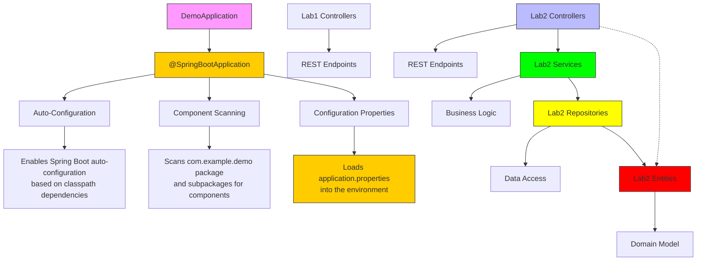
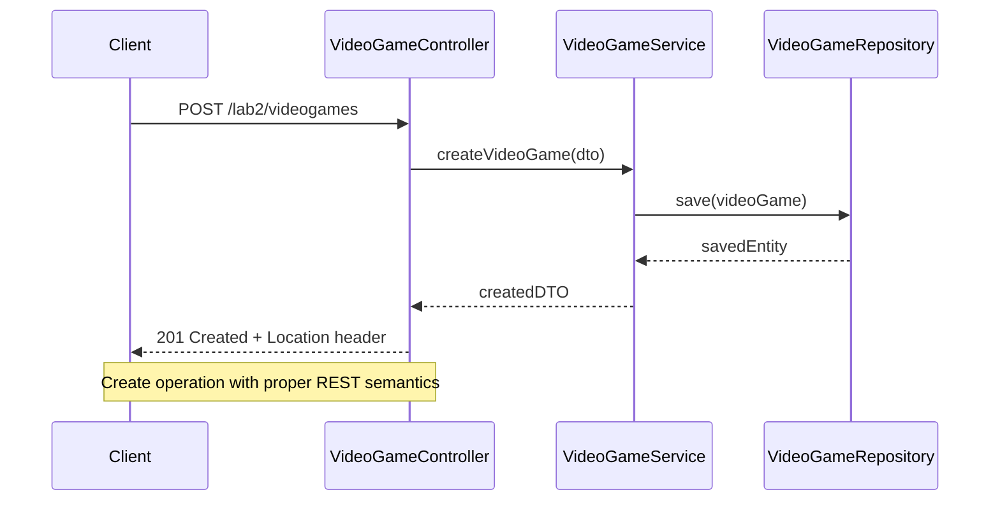
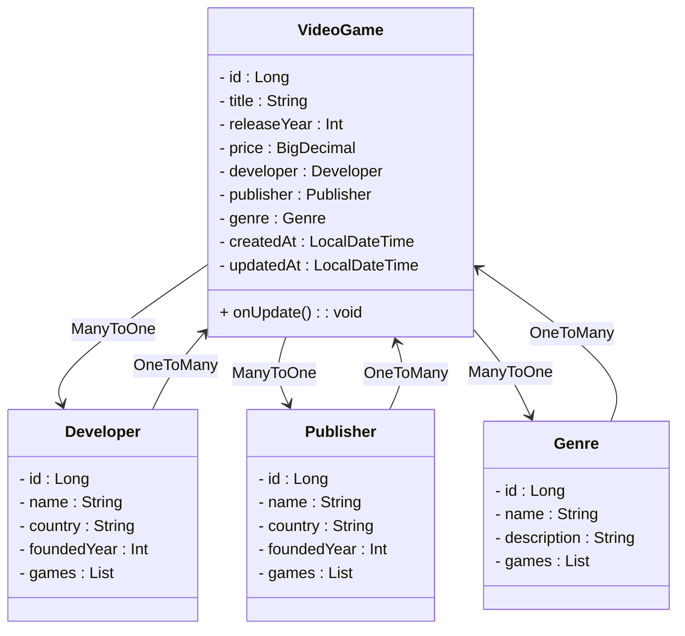
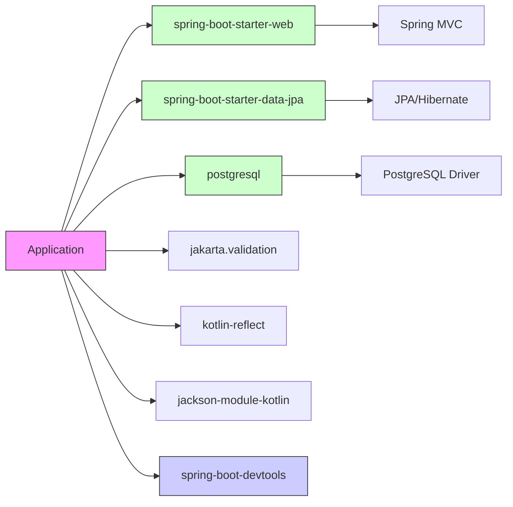

# Application Structure & Configuration

<cite>
**Referenced Files in This Document**   
- [DemoApplication.kt](file://src\main\kotlin\com\example\demo\DemoApplication.kt) - *Updated in recent commit*
- [application.properties](file://src\main\resources\application.properties) - *Updated in recent commit*
- [VideoGameController.kt](file://src\main\kotlin\com\example\demo\Lab2\controllers\VideoGameController.kt) - *Added in recent commit*
- [DeveloperController.kt](file://src\main\kotlin\com\example\demo\Lab2\controllers\DeveloperController.kt) - *Added in recent commit*
- [GenreController.kt](file://src\main\kotlin\com\example\demo\Lab2\controllers\GenreController.kt) - *Added in recent commit*
- [PublisherController.kt](file://src\main\kotlin\com\example\demo\Lab2\controllers\PublisherController.kt) - *Added in recent commit*
- [VideoGameService.kt](file://src\main\kotlin\com\example\demo\Lab2\services\VideoGameService.kt) - *Added in recent commit*
- [DeveloperService.kt](file://src\main\kotlin\com\example\demo\Lab2\services\DeveloperService.kt) - *Added in recent commit*
- [GenreService.kt](file://src\main\kotlin\com\example\demo\Lab2\services\GenreService.kt) - *Added in recent commit*
- [PublisherService.kt](file://src\main\kotlin\com\example\demo\Lab2\services\PublisherService.kt) - *Added in recent commit*
- [VideoGame.kt](file://src\main\kotlin\com\example\demo\Lab2\entities\VideoGame.kt) - *Added in recent commit*
- [Developer.kt](file://src\main\kotlin\com\example\demo\Lab2\entities\Developer.kt) - *Added in recent commit*
- [Genre.kt](file://src\main\kotlin\com\example\demo\Lab2\entities\Genre.kt) - *Added in recent commit*
- [Publisher.kt](file://src\main\kotlin\com\example\demo\Lab2\entities\Publisher.kt) - *Added in recent commit*
- [VideoGameRepository.kt](file://src\main\kotlin\com\example\demo\Lab2\repositories\VideoGameRepository.kt) - *Added in recent commit*
- [DeveloperRepository.kt](file://src\main\kotlin\com\example\demo\Lab2\repositories\DeveloperRepository.kt) - *Added in recent commit*
- [GenreRepository.kt](file://src\main\kotlin\com\example\demo\Lab2\repositories\GenreRepository.kt) - *Added in recent commit*
- [PublisherRepository.kt](file://src\main\kotlin\com\example\demo\Lab2\repositories\PublisherRepository.kt) - *Added in recent commit*
- [StringListController.kt](file://src\main\kotlin\com\example\demo\Lab1\controllers\StringListController.kt) - *Updated in recent commit*
</cite>

## Update Summary
**Changes Made**   
- Updated project structure to reflect Lab1 and Lab2 package organization
- Added detailed information about the 4-layer architecture implemented in Lab2
- Updated application configuration details with actual database settings
- Added comprehensive documentation for the Video Game Store domain model
- Documented the complete controller, service, repository, and entity layers
- Added architectural diagrams reflecting the actual code structure
- Updated troubleshooting guide with Lab2-specific configuration details

## Table of Contents
1. [Introduction](#introduction)
2. [Project Structure](#project-structure)
3. [Core Components](#core-components)
4. [Architecture Overview](#architecture-overview)
5. [Detailed Component Analysis](#detailed-component-analysis)
6. [Dependency Analysis](#dependency-analysis)
7. [Performance Considerations](#performance-considerations)
8. [Troubleshooting Guide](#troubleshooting-guide)
9. [Conclusion](#conclusion)

## Introduction
This document provides a comprehensive overview of the application's file organization and configuration mechanism within a Spring Boot project using Kotlin. It explains the standard directory layout, package structure, component scanning behavior, and configuration loading process. The analysis covers how Spring Boot enables auto-configuration through annotations, the role of configuration files, and best practices for organizing controllers and other components. This update reflects the implementation of a 4-layer architecture for Lab2 with proper separation of concerns and the restructuring of Lab1 code into a dedicated package with organized controllers and models.

## Project Structure

The project follows the standard Maven/Gradle directory layout commonly used in Spring Boot applications. The primary source code resides under `src/main/kotlin`, with resources in `src/main/resources`. Test code is located in `src/test/kotlin`.

Key structural elements include:
- **Kotlin source files**: Located in `src/main/kotlin/com/example/demo`
- **Resource files**: Stored in `src/main/resources`
- **Build configuration**: Managed via `build.gradle`
- **Test classes**: Placed in `src/test/kotlin`

The application has been restructured into two main labs:
- **Lab1**: Contains controllers for basic data type operations with dedicated controllers for String, Number, Boolean, and Primitive types
- **Lab2**: Implements a complete Video Game Store application with a 4-layer architecture (Controller, Service, Repository, Entity)

```mermaid
graph TB
ProjectRoot["Project Root"]
subgraph "Source"
Main["src/main"]
subgraph "Kotlin Code"
Kotlin["kotlin/com/example/demo"]
DemoApp["DemoApplication.kt"]
Lab1["Lab1/"]
Lab1Controllers["controllers/"]
Lab1Models["models/"]
Lab2["Lab2/"]
Lab2Controllers["controllers/"]
Lab2Services["services/"]
Lab2Repositories["repositories/"]
Lab2Entities["entities/"]
Lab2DTO["dto/"]
end
subgraph "Resources"
Resources["resources/"]
AppConfig["application.properties"]
DataSQL["data.sql"]
Static["static/"]
end
end
subgraph "Test"
Test["src/test"]
TestKotlin["kotlin/com/example/demo"]
TestClass["DemoApplicationTests.kt"]
end
Build["build.gradle"]
Settings["settings.gradle"]
ProjectRoot --> Main
ProjectRoot --> Test
ProjectRoot --> Build
ProjectRoot --> Settings
Main --> Kotlin
Main --> Resources
Kotlin --> DemoApp
Kotlin --> Lab1
Kotlin --> Lab2
Lab1 --> Lab1Controllers
Lab1 --> Lab1Models
Lab2 --> Lab2Controllers
Lab2 --> Lab2Services
Lab2 --> Lab2Repositories
Lab2 --> Lab2Entities
Lab2 --> Lab2DTO
Resources --> AppConfig
Resources --> DataSQL
Resources --> Static
Test --> TestKotlin
TestKotlin --> TestClass
style DemoApp fill:#f9f,stroke:#333
style Lab1Controllers fill:#bbf,stroke:#333
style Lab2Controllers fill:#bbf,stroke:#333
style Lab2Services fill:#0f0,stroke:#333
style Lab2Repositories fill:#ff0,stroke:#333
style Lab2Entities fill:#f00,stroke:#333
style AppConfig fill:#ffcc00,stroke:#333
```

**Diagram sources**
- [DemoApplication.kt](file://src\main\kotlin\com\example\demo\DemoApplication.kt)
- [StringListController.kt](file://src\main\kotlin\com\example\demo\Lab1\controllers\StringListController.kt)
- [VideoGameController.kt](file://src\main\kotlin\com\example\demo\Lab2\controllers\VideoGameController.kt)
- [VideoGameService.kt](file://src\main\kotlin\com\example\demo\Lab2\services\VideoGameService.kt)
- [VideoGameRepository.kt](file://src\main\kotlin\com\example\demo\Lab2\repositories\VideoGameRepository.kt)
- [VideoGame.kt](file://src\main\kotlin\com\example\demo\Lab2\entities\VideoGame.kt)
- [application.properties](file://src\main\resources\application.properties)

**Section sources**
- [DemoApplication.kt](file://src\main\kotlin\com\example\demo\DemoApplication.kt)
- [StringListController.kt](file://src\main\kotlin\com\example\demo\Lab1\controllers\StringListController.kt)
- [VideoGameController.kt](file://src\main\kotlin\com\example\demo\Lab2\controllers\VideoGameController.kt)
- [application.properties](file://src\main\resources\application.properties)

## Core Components

The application's core components are organized around the Spring Boot entry point and REST controller pattern. The `DemoApplication.kt` serves as the main class with Spring Boot annotations enabling auto-configuration. The application has been restructured into two distinct labs with separate concerns:

- **Lab1**: Focuses on basic data type operations with controllers for String, Number, Boolean, and Primitive types
- **Lab2**: Implements a complete Video Game Store application with a 4-layer architecture

The package `com.example.demo` follows Java/Kotlin naming conventions and serves as the base package for component scanning. All components within this package and its subpackages are automatically detected by Spring's component scanning mechanism.

**Section sources**
- [DemoApplication.kt](file://src\main\kotlin\com\example\demo\DemoApplication.kt#L1-L12)
- [StringListController.kt](file://src\main\kotlin\com\example\demo\Lab1\controllers\StringListController.kt#L1-L83)
- [VideoGameController.kt](file://src\main\kotlin\com\example\demo\Lab2\controllers\VideoGameController.kt#L1-L98)

## Architecture Overview

The application architecture follows the standard Spring Boot pattern with a single entry point class annotated with `@SpringBootApplication`. This annotation enables three key features:
1. Auto-configuration: Automatically configures beans based on classpath and application context
2. Component scanning: Detects components, services, repositories, and controllers in the base package
3. Configuration properties: Loads external configuration into the application context

The architecture is designed to be extensible, with the ability to add new controllers, services, and configuration properties as needed. Lab2 implements a clean 4-layer architecture with proper separation of concerns:



**Diagram sources**
- [DemoApplication.kt](file://src\main\kotlin\com\example\demo\DemoApplication.kt#L5-L12)
- [VideoGameController.kt](file://src\main\kotlin\com\example\demo\Lab2\controllers\VideoGameController.kt#L13-L97)
- [VideoGameService.kt](file://src\main\kotlin\com\example\demo\Lab2\services\VideoGameService.kt#L15-L182)
- [VideoGameRepository.kt](file://src\main\kotlin\com\example\demo\Lab2\repositories\VideoGameRepository.kt#L1-L43)
- [VideoGame.kt](file://src\main\kotlin\com\example\demo\Lab2\entities\VideoGame.kt#L9-L61)
- [application.properties](file://src\main\resources\application.properties)

## Detailed Component Analysis

### Main Application Class Analysis

The `DemoApplication` class serves as the entry point for the Spring Boot application. It uses the `@SpringBootApplication` annotation which combines `@Configuration`, `@EnableAutoConfiguration`, and `@ComponentScan` annotations.

The `main` function uses Kotlin's `runApplication` extension function to bootstrap the Spring application context. This function initializes the application and starts the embedded web server.

```mermaid
classDiagram
class DemoApplication {
+main(args : Array<String>)
}
note right of DemoApplication
Entry point for Spring Boot application
Uses @SpringBootApplication annotation
Enables auto-configuration and component scanning
end note
```

**Diagram sources**
- [DemoApplication.kt](file://src\main\kotlin\com\example\demo\DemoApplication.kt#L5-L12)

**Section sources**
- [DemoApplication.kt](file://src\main\kotlin\com\example\demo\DemoApplication.kt#L1-L12)

### Controller Component Analysis

The Lab2 controllers are annotated with `@RestController`, making them Spring MVC controllers that return data directly (rather than views). They follow REST conventions with appropriate HTTP methods for CRUD operations.

The `VideoGameController` demonstrates dependency injection by receiving a `VideoGameService` instance through constructor injection, promoting loose coupling and testability.



**Diagram sources**
- [VideoGameController.kt](file://src\main\kotlin\com\example\demo\Lab2\controllers\VideoGameController.kt#L13-L97)
- [VideoGameService.kt](file://src\main\kotlin\com\example\demo\Lab2\services\VideoGameService.kt#L15-L182)
- [VideoGameRepository.kt](file://src\main\kotlin\com\example\demo\Lab2\repositories\VideoGameRepository.kt#L1-L43)

**Section sources**
- [VideoGameController.kt](file://src\main\kotlin\com\example\demo\Lab2\controllers\VideoGameController.kt#L1-L98)
- [VideoGameService.kt](file://src\main\kotlin\com\example\demo\Lab2\services\VideoGameService.kt#L1-L183)
- [VideoGameRepository.kt](file://src\main\kotlin\com\example\demo\Lab2\repositories\VideoGameRepository.kt#L1-L43)

### Service Layer Analysis

The service layer implements the business logic of the application. The `VideoGameService` class is annotated with `@Service` and `@Transactional`, ensuring that business operations are executed within transaction boundaries.

The service layer validates business rules such as:
- Ensuring release year is not more than 2 years in the future
- Validating that referenced entities (developer, publisher, genre) exist
- Enforcing business constraints during create, update, and delete operations

```mermaid
classDiagram
class VideoGameService {
- videoGameRepository : VideoGameRepository
- developerRepository : DeveloperRepository
- publisherRepository : PublisherRepository
- genreRepository : GenreRepository
+ createVideoGame(dto : VideoGameCreateDTO) : VideoGameResponseDTO
+ getAllVideoGames(...) : List<VideoGameResponseDTO>
+ getVideoGameById(id : Long) : VideoGameResponseDTO
+ updateVideoGame(id : Long, dto : VideoGameUpdateDTO) : VideoGameResponseDTO
+ patchVideoGame(id : Long, dto : VideoGamePatchDTO) : VideoGameResponseDTO
+ deleteVideoGame(id : Long) : void
- validateReleaseYear(year : Int) : void
}
note right of VideoGameService
Implements business logic with transactional boundaries
Validates business rules and coordinates repository operations
end note
```

**Diagram sources**
- [VideoGameService.kt](file://src\main\kotlin\com\example\demo\Lab2\services\VideoGameService.kt#L15-L182)

**Section sources**
- [VideoGameService.kt](file://src\main\kotlin\com\example\demo\Lab2\services\VideoGameService.kt#L1-L183)

### Repository Layer Analysis

The repository layer provides data access through Spring Data JPA. The `VideoGameRepository` interface extends `JpaRepository<VideoGame, Long>`, inheriting standard CRUD operations while also defining custom query methods for filtering video games by various criteria.

Custom repository methods include:
- `findByGenreId(genreId: Long)`: Find games by genre
- `findByDeveloperId(developerId: Long)`: Find games by developer
- `findByPublisherId(publisherId: Long)`: Find games by publisher
- `findByReleaseYear(releaseYear: Int)`: Find games by release year
- `findByPriceBetween(minPrice: BigDecimal, maxPrice: BigDecimal)`: Find games by price range
- `findByTitleContainingIgnoreCase(title: String)`: Find games by title (case-insensitive)

```mermaid
classDiagram
class VideoGameRepository {
+ findByGenreId(genreId : Long) : List<VideoGame>
+ findByDeveloperId(developerId : Long) : List<VideoGame>
+ findByPublisherId(publisherId : Long) : List<VideoGame>
+ findByReleaseYear(releaseYear : Int) : List<VideoGame>
+ findByPriceBetween(minPrice : BigDecimal, maxPrice : BigDecimal) : List<VideoGame>
+ findByTitleContainingIgnoreCase(title : String) : List<VideoGame>
}
note right of VideoGameRepository
Extends JpaRepository for standard CRUD operations
Defines custom query methods for filtering video games
end note
```

**Diagram sources**
- [VideoGameRepository.kt](file://src\main\kotlin\com\example\demo\Lab2\repositories\VideoGameRepository.kt#L1-L43)

**Section sources**
- [VideoGameRepository.kt](file://src\main\kotlin\com\example\demo\Lab2\repositories\VideoGameRepository.kt#L1-L43)

### Entity Layer Analysis

The entity layer represents the domain model of the application. The `VideoGame` entity has relationships with other entities through JPA annotations:

- `@ManyToOne` relationships with `Developer`, `Publisher`, and `Genre` entities
- `@OneToMany` relationships from `Developer`, `Publisher`, and `Genre` to `VideoGame`
- Proper cascade and fetch strategies for performance optimization

The entities include lifecycle callbacks (`@PreUpdate`) to automatically update timestamps and implement proper `equals` and `hashCode` methods based on entity identity.



**Diagram sources**
- [VideoGame.kt](file://src\main\kotlin\com\example\demo\Lab2\entities\VideoGame.kt#L9-L61)
- [Developer.kt](file://src\main\kotlin\com\example\demo\Lab2\entities\Developer.kt#L8-L51)
- [Publisher.kt](file://src\main\kotlin\com\example\demo\Lab2\entities\Publisher.kt#L8-L51)
- [Genre.kt](file://src\main\kotlin\com\example\demo\Lab2\entities\Genre.kt#L8-L48)

**Section sources**
- [VideoGame.kt](file://src\main\kotlin\com\example\demo\Lab2\entities\VideoGame.kt#L1-L62)
- [Developer.kt](file://src\main\kotlin\com\example\demo\Lab2\entities\Developer.kt)
- [Publisher.kt](file://src\main\kotlin\com\example\demo\Lab2\entities\Publisher.kt)
- [Genre.kt](file://src\main\kotlin\com\example\demo\Lab2\entities\Genre.kt)

## Dependency Analysis

The application's dependencies are managed through Gradle, with key Spring Boot starter dependencies enabling web functionality. The `build.gradle` file specifies the Spring Boot version and Kotlin plugin versions, ensuring compatibility between components.

The dependency structure shows a clear separation between implementation and test dependencies, with development-only tools like DevTools included for enhanced developer experience. The application uses PostgreSQL as the database with appropriate JDBC and JPA configurations.



**Diagram sources**
- [build.gradle](file://build.gradle)

**Section sources**
- [build.gradle](file://build.gradle)

## Performance Considerations

The current application has several performance considerations due to its database-backed nature:

1. **Database Configuration**: The application uses PostgreSQL with connection pooling and JPA optimization settings
2. **Transaction Management**: Service methods are annotated with `@Transactional` to ensure proper transaction boundaries
3. **Fetch Strategies**: Entities use appropriate fetch strategies (EAGER for direct relationships, LAZY for collections)
4. **Indexing**: Database tables should have appropriate indexes on frequently queried fields
5. **Caching**: Consider implementing Spring Cache for frequently accessed data

The `application.properties` file provides configuration for database connectivity, JPA behavior, and SQL logging, which can be tuned for performance:

```properties
# Database Configuration
spring.datasource.url=jdbc:postgresql://localhost:5432/lab2_videogames
spring.datasource.username=postgres
spring.datasource.password=postgres
spring.datasource.driver-class-name=org.postgresql.Driver

# JPA Configuration
spring.jpa.database-platform=org.hibernate.dialect.PostgreSQLDialect
spring.jpa.hibernate.ddl-auto=update
spring.jpa.show-sql=true
spring.jpa.properties.hibernate.format_sql=true
```

**Section sources**
- [application.properties](file://src\main\resources\application.properties)
- [build.gradle](file://build.gradle)

## Troubleshooting Guide

Common configuration issues and their solutions:

1. **Database Connection Issues**: Ensure PostgreSQL is running and the connection details in `application.properties` are correct:
   ```properties
   spring.datasource.url=jdbc:postgresql://localhost:5432/lab2_videogames
   spring.datasource.username=postgres
   spring.datasource.password=postgres
   ```

2. **Entity Validation Errors**: Check that required fields are provided and constraints are met:
   - Release year cannot be more than 2 years in the future
   - Developer, publisher, and genre names must be unique
   - Price must be a valid decimal number

3. **Foreign Key Constraint Violations**: Ensure referenced entities exist before creating dependent entities:
   - Create developer, publisher, and genre before creating video games
   - Use existing entity IDs when creating relationships

4. **Port Conflicts**: Change the server port in `application.properties`:
   ```properties
   server.port=8081
   ```

5. **Data Initialization**: The application uses `data.sql` to initialize the database with sample data. Ensure this file is properly formatted and located in `src/main/resources`.

Example configuration additions for `application.properties`:
```properties
# Set server port
server.port=8081

# Enable debug logging
logging.level.org.springframework=DEBUG
logging.level.com.example.demo=DEBUG

# Set application name
spring.application.name=video-game-store

# Configure connection pool
spring.datasource.hikari.maximum-pool-size=20
spring.datasource.hikari.minimum-idle=5
```

**Section sources**
- [application.properties](file://src\main\resources\application.properties)
- [build.gradle](file://build.gradle)
- [data.sql](file://src\main\resources\data.sql)

## Conclusion

The application demonstrates a standard Spring Boot project structure with Kotlin, following best practices for file organization and configuration. The use of `@SpringBootApplication` enables automatic configuration and component scanning within the `com.example.demo` package. The application has been restructured into two distinct labs with separate concerns:

- **Lab1**: Focuses on basic data type operations with a simple controller structure
- **Lab2**: Implements a complete 4-layer architecture (Controller, Service, Repository, Entity) for a Video Game Store application

The `application.properties` file provides a flexible mechanism for external configuration, while the Gradle build system manages dependencies effectively. This structure is extensible and maintainable, providing a solid foundation for further development. The implementation follows clean architecture principles with proper separation of concerns, making the codebase easier to understand, test, and maintain.