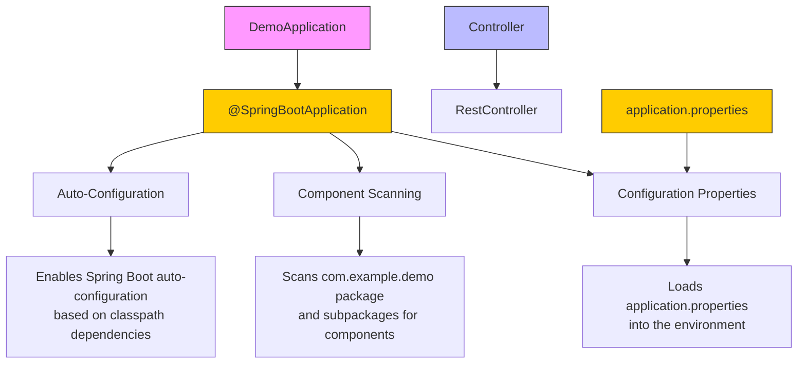
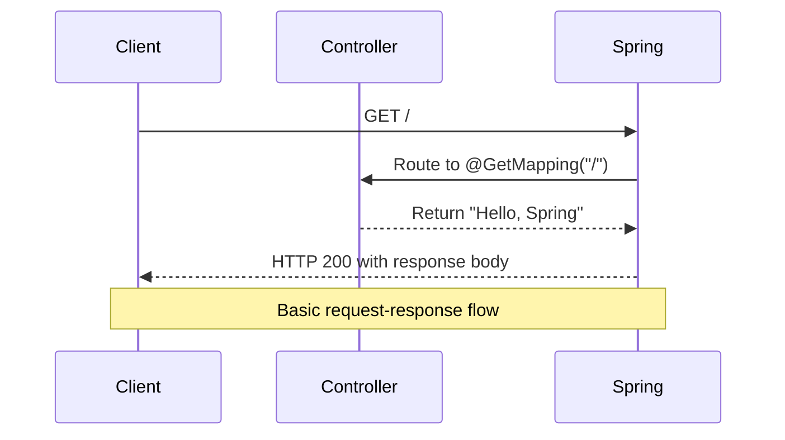
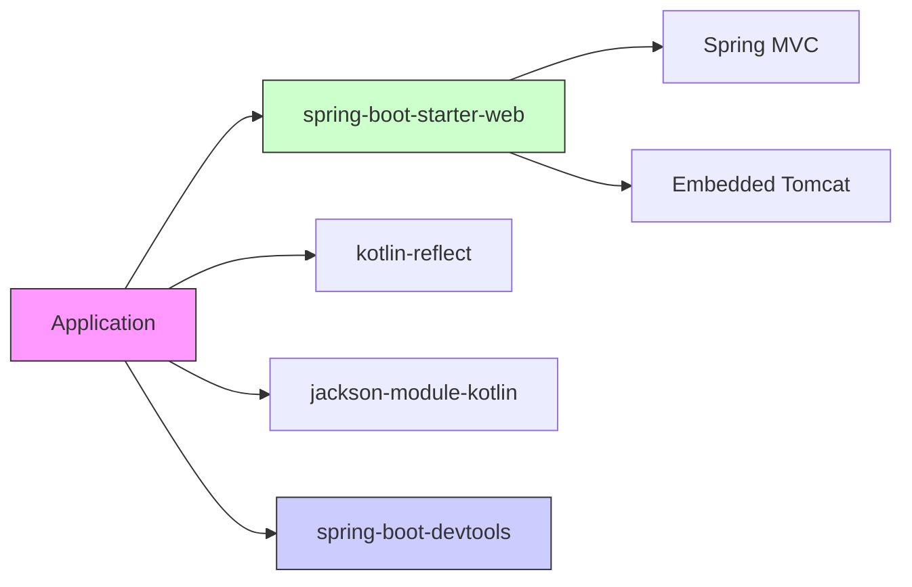

# Application Structure & Configuration

<cite>
**Referenced Files in This Document**   
- [DemoApplication.kt](file://src/main/kotlin/com/example/demo/DemoApplication.kt)
- [Controller.kt](file://src/main/kotlin/com/example/demo/controllers/Controller.kt)
- [application.properties](file://src/main/resources/application.properties)
- [build.gradle](file://build.gradle)
- [DemoApplicationTests.kt](file://src/test/kotlin/com/example/demo/DemoApplicationTests.kt)
</cite>

## Table of Contents
1. [Introduction](#introduction)
2. [Project Structure](#project-structure)
3. [Core Components](#core-components)
4. [Architecture Overview](#architecture-overview)
5. [Detailed Component Analysis](#detailed-component-analysis)
6. [Dependency Analysis](#dependency-analysis)
7. [Performance Considerations](#performance-considerations)
8. [Troubleshooting Guide](#troubleshooting-guide)
9. [Conclusion](#conclusion)

## Introduction
This document provides a comprehensive overview of the application's file organization and configuration mechanism within a Spring Boot project using Kotlin. It explains the standard directory layout, package structure, component scanning behavior, and configuration loading process. The analysis covers how Spring Boot enables auto-configuration through annotations, the role of configuration files, and best practices for organizing controllers and other components.

## Project Structure

The project follows the standard Maven/Gradle directory layout commonly used in Spring Boot applications. The primary source code resides under `src/main/kotlin`, with resources in `src/main/resources`. Test code is located in `src/test/kotlin`.

Key structural elements include:
- **Kotlin source files**: Located in `src/main/kotlin/com/example/demo`
- **Resource files**: Stored in `src/main/resources`
- **Build configuration**: Managed via `build.gradle`
- **Test classes**: Placed in `src/test/kotlin`

This structure enables clear separation of concerns and aligns with Spring Boot conventions for Kotlin-based applications.

```mermaid
graph TB
ProjectRoot["Project Root"]
subgraph "Source"
Main["src/main"]
subgraph "Kotlin Code"
Kotlin["kotlin/com/example/demo"]
DemoApp["DemoApplication.kt"]
Controllers["controllers/"]
Controller["Controller.kt"]
end
subgraph "Resources"
Resources["resources/"]
AppConfig["application.properties"]
end
end
subgraph "Test"
Test["src/test"]
TestKotlin["kotlin/com/example/demo"]
TestClass["DemoApplicationTests.kt"]
end
Build["build.gradle"]
Settings["settings.gradle"]
ProjectRoot --> Main
ProjectRoot --> Test
ProjectRoot --> Build
ProjectRoot --> Settings
Main --> Kotlin
Main --> Resources
Kotlin --> DemoApp
Kotlin --> Controllers
Controllers --> Controller
Resources --> AppConfig
Test --> TestKotlin
TestKotlin --> TestClass
style DemoApp fill:#f9f,stroke:#333
style Controller fill:#bbf,stroke:#333
style AppConfig fill:#ffcc00,stroke:#333
```

**Diagram sources**
- [DemoApplication.kt](file://src/main/kotlin/com/example/demo/DemoApplication.kt)
- [Controller.kt](file://src/main/kotlin/com/example/demo/controllers/Controller.kt)
- [application.properties](file://src/main/resources/application.properties)

**Section sources**
- [DemoApplication.kt](file://src/main/kotlin/com/example/demo/DemoApplication.kt)
- [Controller.kt](file://src/main/kotlin/com/example/demo/controllers/Controller.kt)
- [application.properties](file://src/main/resources/application.properties)

## Core Components

The application's core components are organized around the Spring Boot entry point and REST controller pattern. The `DemoApplication.kt` serves as the main class with Spring Boot annotations enabling auto-configuration. The `Controller.kt` file contains a REST controller that handles HTTP requests.

The package `com.example.demo` follows Java/Kotlin naming conventions and serves as the base package for component scanning. All components within this package and its subpackages are automatically detected by Spring's component scanning mechanism.

**Section sources**
- [DemoApplication.kt](file://src/main/kotlin/com/example/demo/DemoApplication.kt#L1-L12)
- [Controller.kt](file://src/main/kotlin/com/example/demo/controllers/Controller.kt#L1-L12)

## Architecture Overview

The application architecture follows the standard Spring Boot pattern with a single entry point class annotated with `@SpringBootApplication`. This annotation enables three key features:
1. Auto-configuration: Automatically configures beans based on classpath and application context
2. Component scanning: Detects components, services, repositories, and controllers in the base package
3. Configuration properties: Loads external configuration into the application context

The architecture is designed to be extensible, with the ability to add new controllers, services, and configuration properties as needed.



**Diagram sources**
- [DemoApplication.kt](file://src/main/kotlin/com/example/demo/DemoApplication.kt#L5-L12)
- [Controller.kt](file://src/main/kotlin/com/example/demo/controllers/Controller.kt#L5-L12)
- [application.properties](file://src/main/resources/application.properties)

## Detailed Component Analysis

### Main Application Class Analysis

The `DemoApplication` class serves as the entry point for the Spring Boot application. It uses the `@SpringBootApplication` annotation which combines `@Configuration`, `@EnableAutoConfiguration`, and `@ComponentScan` annotations.

The `main` function uses Kotlin's `runApplication` extension function to bootstrap the Spring application context. This function initializes the application and starts the embedded web server.

```mermaid
classDiagram
class DemoApplication {
+main(args : Array<String>)
}
note right of DemoApplication
Entry point for Spring Boot application
Uses @SpringBootApplication annotation
Enables auto-configuration and component scanning
end note
```

**Diagram sources**
- [DemoApplication.kt](file://src/main/kotlin/com/example/demo/DemoApplication.kt#L5-L12)

**Section sources**
- [DemoApplication.kt](file://src/main/kotlin/com/example/demo/DemoApplication.kt#L1-L12)

### Controller Component Analysis

The `HomeController` class is annotated with `@RestController`, making it a Spring MVC controller that returns data directly (rather than views). It contains a single endpoint mapped to the root URL (`/`) using the `@GetMapping` annotation.

The controller demonstrates Kotlin's concise syntax with a function that returns a string directly without explicit return keywords.



**Diagram sources**
- [Controller.kt](file://src/main/kotlin/com/example/demo/controllers/Controller.kt#L5-L12)

**Section sources**
- [Controller.kt](file://src/main/kotlin/com/example/demo/controllers/Controller.kt#L1-L12)

## Dependency Analysis

The application's dependencies are managed through Gradle, with key Spring Boot starter dependencies enabling web functionality. The `build.gradle` file specifies the Spring Boot version and Kotlin plugin versions, ensuring compatibility between components.

The dependency structure shows a clear separation between implementation and test dependencies, with development-only tools like DevTools included for enhanced developer experience.



**Diagram sources**
- [build.gradle](file://build.gradle#L1-L52)

**Section sources**
- [build.gradle](file://build.gradle#L1-L52)

## Performance Considerations

The current application has minimal performance considerations due to its simplicity. However, the architecture supports performance optimizations through:
- Embedded server configuration (port, thread pool settings)
- Caching mechanisms via Spring Cache
- Asynchronous processing with `@Async`
- Connection pooling for database operations (when added)

The empty `application.properties` file provides a foundation for adding performance-related configurations such as server tuning, logging levels, and security settings.

## Troubleshooting Guide

Common configuration issues and their solutions:

1. **Component not detected**: Ensure the component is in the `com.example.demo` package or subpackage, or explicitly configure component scanning base packages.

2. **Port conflicts**: Add `server.port=8081` (or another port) to `application.properties` to change the default port.

3. **Kotlin reflection issues**: Ensure `kotlin-reflect` dependency is present in `build.gradle`.

4. **Application fails to start**: Check that the `@SpringBootApplication` class is in the root package containing all components.

Example configuration additions for `application.properties`:
```
# Set server port
server.port=8081

# Enable debug logging
logging.level.org.springframework=DEBUG

# Set application name
spring.application.name=my-demo-app

# Configure datasource (example)
# spring.datasource.url=jdbc:h2:mem:testdb
# spring.datasource.driver-class-name=org.h2.Driver
```

**Section sources**
- [application.properties](file://src/main/resources/application.properties)
- [build.gradle](file://build.gradle)

## Conclusion

The application demonstrates a standard Spring Boot project structure with Kotlin, following best practices for file organization and configuration. The use of `@SpringBootApplication` enables automatic configuration and component scanning within the `com.example.demo` package. The `application.properties` file provides a flexible mechanism for external configuration, while the Gradle build system manages dependencies effectively. This structure is extensible and maintainable, providing a solid foundation for further development.