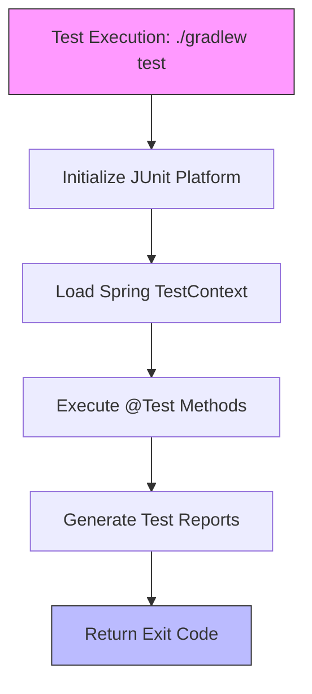
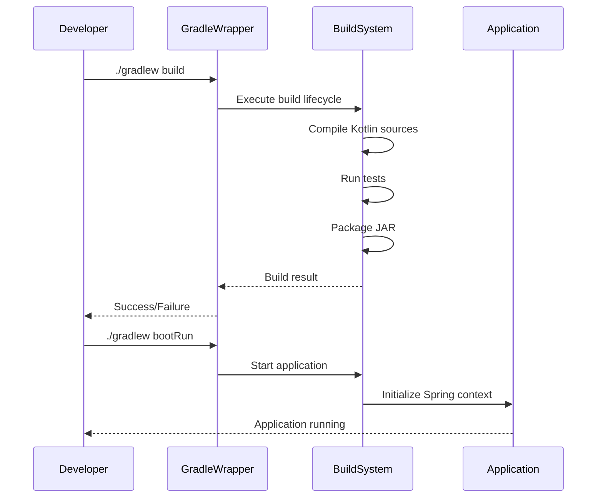

# Build & Dependency Management

<cite>
**Referenced Files in This Document**   
- [build.gradle](file://build.gradle)
- [settings.gradle](file://settings.gradle)
- [DemoApplication.kt](file://src/main/kotlin/com/example/demo/DemoApplication.kt)
- [DemoApplicationTests.kt](file://src/test/kotlin/com/example/demo/DemoApplicationTests.kt)
</cite>

## Table of Contents
1. [Gradle Build Configuration Overview](#gradle-build-configuration-overview)
2. [Plugins Configuration](#plugins-configuration)
3. [Project Metadata](#project-metadata)
4. [Java Toolchain Configuration](#java-toolchain-configuration)
5. [Repository Declaration](#repository-declaration)
6. [Dependency Configurations](#dependency-configurations)
7. [Dependency Analysis](#dependency-analysis)
8. [Kotlin Compiler Options](#kotlin-compiler-options)
9. [Test Configuration](#test-configuration)
10. [Common Build Operations](#common-build-operations)
11. [Troubleshooting Common Issues](#troubleshooting-common-issues)
12. [Build Customization for Different Environments](#build-customization-for-different-environments)

## Gradle Build Configuration Overview

The Gradle build system in this Spring Boot application provides a comprehensive configuration for Kotlin-based development with modern Java features. The build.gradle file serves as the central configuration point for plugins, dependencies, repositories, and build tasks. This configuration enables seamless integration between Kotlin and Spring Boot frameworks while maintaining dependency management best practices.

**Section sources**
- [build.gradle](file://build.gradle#L1-L52)

## Plugins Configuration

The plugins block defines essential plugins that enable Kotlin and Spring Boot functionality within the Gradle build system. The configuration includes four critical plugins:

- **Kotlin JVM Plugin**: Enables Kotlin compilation for the JVM platform, allowing Kotlin code to be compiled into Java bytecode.
- **Kotlin Spring Plugin**: Provides Kotlin-specific extensions and optimizations for Spring Framework integration, including support for Spring's annotation-based programming model.
- **Spring Boot Plugin**: Integrates Spring Boot's build capabilities, enabling executable jar creation, embedded server configuration, and Spring Boot's dependency management.
- **Dependency Management Plugin**: Imports Maven BOM (Bill of Materials) files to manage dependency versions consistently across the project.

These plugins work together to provide a cohesive development experience that combines Kotlin's modern language features with Spring Boot's convention-over-configuration approach.

**Section sources**
- [build.gradle](file://build.gradle#L1-L6)

## Project Metadata

The project metadata section defines essential identification and versioning information for the application. This metadata is used for artifact naming, dependency resolution, and documentation purposes:

- **Group**: Set to 'com.example', following Java package naming conventions, which identifies the organization or project namespace.
- **Version**: Set to '0.0.1-SNAPSHOT', indicating an initial development version with snapshot status, meaning it's actively being developed and may change frequently.
- **Description**: Provides a human-readable description of the project as 'Demo project for Spring Boot', useful for documentation and build reports.

This metadata is crucial for dependency management when this project is consumed as a library by other projects and appears in generated artifacts like JAR files.

**Section sources**
- [build.gradle](file://build.gradle#L7-L9)

## Java Toolchain Configuration

The Java toolchain configuration specifies that the project should be compiled using Java 21, ensuring consistent compilation across different development environments regardless of the locally installed JDK version. This configuration provides several benefits:

- **Build reproducibility**: Ensures all developers and CI/CD systems use the same Java version
- **Forward compatibility**: Enables use of Java 21 language features and performance improvements
- **Simplified setup**: Gradle can automatically download and manage the required JDK version if not present

The toolchain configuration abstracts away JDK management, allowing developers to focus on coding rather than environment setup, while ensuring production parity.

**Section sources**
- [build.gradle](file://build.gradle#L11-L15)

## Repository Declaration

The repository configuration declares mavenCentral() as the primary source for dependencies. Maven Central is the largest public repository for Java and Kotlin libraries, providing access to:

- Official Spring Framework and Spring Boot artifacts
- Kotlin standard library and compiler artifacts
- Third-party libraries used in the project
- Transitive dependencies required by direct dependencies

By using mavenCentral(), the project benefits from a vast ecosystem of well-maintained, versioned libraries with strong community support and security updates.

**Section sources**
- [build.gradle](file://build.gradle#L17-L19)

## Dependency Configurations

The configurations block defines custom dependency configurations that extend Gradle's built-in scopes:

- **developmentOnly**: A custom configuration for dependencies that are only needed during development, such as devtools that provide enhanced development features like live reloading.
- **runtimeClasspath**: Extended to include developmentOnly dependencies, ensuring that development tools are available at runtime during development but can be excluded in production builds.

This configuration pattern enables environment-specific dependency management, optimizing the final artifact size for production while enhancing the development experience.

**Section sources**
- [build.gradle](file://build.gradle#L21-L25)

## Dependency Analysis

The dependencies block lists all external libraries required by the application, categorized by their usage context:

- **Implementation Dependencies**: Libraries required for the application to function
  - spring-boot-starter-web: Core Spring Boot starter for web applications, including Spring MVC and embedded Tomcat
  - jackson-module-kotlin: Enables Jackson JSON processing library to work seamlessly with Kotlin data classes
  - kotlin-reflect: Provides Kotlin reflection capabilities for framework integration

- **Test Dependencies**: Libraries required only for testing
  - spring-boot-starter-test: Comprehensive testing support for Spring Boot applications
  - kotlin-test-junit5: Kotlin-specific testing utilities for JUnit 5
  - junit-platform-launcher: Runtime for executing JUnit tests

- **Development Dependency**: 
  - spring-boot-devtools: Development-time features like automatic restart and live reloading

Each dependency is carefully selected to provide necessary functionality while minimizing bloat and version conflicts.

**Section sources**
- [build.gradle](file://build.gradle#L28-L36)

## Kotlin Compiler Options

The Kotlin compiler configuration includes specific compiler arguments to enhance code quality and null-safety:

- **-Xjsr305=strict**: Enables strict validation of JSR-305 annotations (like @Nullable and @NonNull), improving null-safety when interoperating with Java code. This setting helps catch potential null pointer exceptions at compile time rather than runtime.

This configuration leverages Kotlin's excellent Java interoperability features while maintaining the language's strong null-safety guarantees, which is particularly important in Spring applications that heavily use Java-based frameworks.

**Section sources**
- [build.gradle](file://build.gradle#L40-L42)

## Test Configuration

The test configuration integrates JUnit Platform as the test engine for executing tests:

- **useJUnitPlatform()**: Configures the test task to use JUnit 5's platform, enabling modern testing features like nested tests, parameterized tests, and improved test lifecycle management.
- The configuration works with the testImplementation dependencies to provide a comprehensive testing environment.

The test setup is further validated by the DemoApplicationTests class, which uses Spring Boot's testing support to verify that the application context loads correctly, ensuring basic application integrity.

**Diagram sources**
- [build.gradle](file://build.gradle#L44-L46)
- [DemoApplicationTests.kt](file://src/test/kotlin/com/example/demo/DemoApplicationTests.kt#L1-L14)

**Section sources**
- [build.gradle](file://build.gradle#L44-L46)
- [DemoApplicationTests.kt](file://src/test/kotlin/com/example/demo/DemoApplicationTests.kt#L1-L14)

## Common Build Operations

The Gradle wrapper (gradlew) provides standardized commands for common build operations:

- **./gradlew build**: Compiles the application, runs all tests, and packages the application into a distributable JAR file. This command executes the complete build lifecycle, ensuring code quality before deployment.

- **./gradlew bootRun**: Starts the Spring Boot application with the embedded server, enabling rapid development and testing. This command automatically handles classpath setup and application initialization.

- **./gradlew test**: Executes all unit and integration tests in the project, generating test reports and failing the build if any tests fail. This is essential for maintaining code quality during development.

These commands are executed through the Gradle wrapper (gradlew), which ensures consistent Gradle version usage across all development environments.

**Diagram sources**
- [build.gradle](file://build.gradle#L48-L50)
- [DemoApplication.kt](file://src/main/kotlin/com/example/demo/DemoApplication.kt#L1-L12)

**Section sources**
- [build.gradle](file://build.gradle#L44-L50)
- [gradlew.bat](file://gradlew.bat)

## Troubleshooting Common Issues

### Dependency Resolution Failures
When dependencies fail to resolve:
1. Verify internet connectivity and repository access
2. Clear Gradle cache with `./gradlew --refresh-dependencies`
3. Check for typos in dependency coordinates
4. Ensure mavenCentral() is properly declared in repositories

### Wrapper Problems
For Gradle wrapper issues:
1. Regenerate wrapper files using `gradle wrapper` command
2. Verify gradlew and gradlew.bat have execute permissions
3. Check JAVA_HOME environment variable points to valid JDK

### Build Configuration Issues
Common configuration problems and solutions:
- **Kotlin version mismatch**: Ensure Kotlin plugin version matches compiler requirements
- **Java version conflicts**: Verify toolchain configuration aligns with installed JDKs
- **Plugin incompatibility**: Check plugin documentation for version compatibility

These issues are typically resolved by verifying configuration consistency and ensuring all components are properly synchronized.

**Section sources**
- [build.gradle](file://build.gradle#L1-L52)

## Build Customization for Different Environments

The build configuration can be customized for different environments through several approaches:

- **Profile-specific properties**: Using application-{profile}.properties files in src/main/resources
- **Conditional dependencies**: Adding environment-specific dependencies in the build script
- **Custom tasks**: Defining Gradle tasks for specific deployment scenarios
- **Property overrides**: Using command-line properties to override build settings

The current configuration supports environment differentiation through the developmentOnly configuration, which allows devtools to be included only in development environments while being excluded from production builds. This pattern can be extended to support additional environments like staging or testing with custom configurations and conditional logic in the build script.

**Section sources**
- [build.gradle](file://build.gradle#L21-L25)
- [settings.gradle](file://settings.gradle#L1-L2)