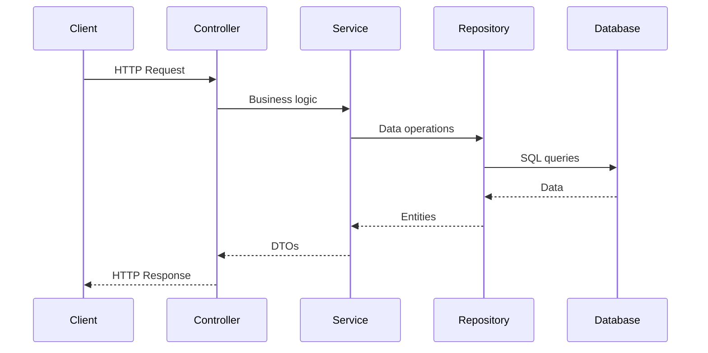

# Development Setup Guide

<cite>
**Referenced Files in This Document**   
- [build.gradle](file://build.gradle) - *Updated with PostgreSQL and JPA dependencies*
- [application.properties](file://src\main\resources\application.properties) - *Database configuration added*
- [DemoApplication.kt](file://src\main\kotlin\com\example\demo\DemoApplication.kt) - *Spring Boot application entry point*
- [VideoGameController.kt](file://src\main\kotlin\com\example\demo\Lab2\controllers\VideoGameController.kt) - *Main controller for video game operations*
- [Lab2_IMPLEMENTATION_SUMMARY.md](file://Lab2_IMPLEMENTATION_SUMMARY.md) - *Implementation details for Lab2*
- [QUICKSTART.md](file://QUICKSTART.md) - *Quick start guide for Lab2 setup*
</cite>

## Update Summary
**Changes Made**   
- Added PostgreSQL database setup requirements and configuration instructions
- Updated prerequisites to include database requirements
- Added detailed database configuration section
- Enhanced troubleshooting section with database-specific issues
- Updated running instructions to include database setup steps
- Added quick start guide reference for immediate setup

## Table of Contents
1. [Introduction](#introduction)
2. [Prerequisites](#prerequisites)
3. [Database Setup](#database-setup)
4. [Cloning and Project Setup](#cloning-and-project-setup)
5. [Importing the Gradle Project](#importing-the-gradle-project)
6. [Running the Application](#running-the-application)
7. [Accessing the Application](#accessing-the-application)
8. [Modifying the Greeting Message](#modifying-the-greeting-message)
9. [Adding New Endpoints and Controllers](#adding-new-endpoints-and-controllers)
10. [Troubleshooting Common Issues](#troubleshooting-common-issues)
11. [IDE-Specific Guidance](#ide-specific-guidance)
12. [Environment Configuration](#environment-configuration)

## Introduction
This guide provides comprehensive instructions for setting up a local development environment for the Spring Boot Kotlin demo application. It covers all necessary prerequisites, database setup, project configuration, execution methods, and customization options to help developers get started quickly and efficiently. The application now features persistent data storage with PostgreSQL and a complete REST API for managing video games and related entities.

**Section sources**
- [Lab2_IMPLEMENTATION_SUMMARY.md](file://Lab2_IMPLEMENTATION_SUMMARY.md#L1-L20) - *Project overview and implementation details*

## Prerequisites
Before beginning development, ensure the following prerequisites are installed and configured:

- **JDK 21**: The project is configured to use Java 21 via the toolchain specification in `build.gradle`. Verify installation with `java -version`.
- **Gradle 8.x**: The project uses Gradle as its build system. The included Gradle Wrapper (`gradlew`) ensures compatibility with Gradle 8.x.
- **Kotlin Plugin**: Required for Kotlin compilation and IDE support. This is already declared in the `build.gradle` file.
- **IDE with Spring Boot Support**: Recommended IDEs include IntelliJ IDEA (with Spring Boot and Kotlin plugins) or VS Code (with appropriate extensions for Kotlin and Spring development).
- **PostgreSQL Database**: Required for persistent data storage. The application is configured to connect to a PostgreSQL database named `lab2_videogames`.

**Section sources**
- [build.gradle](file://build.gradle#L5-L10)
- [Lab2_IMPLEMENTATION_SUMMARY.md](file://Lab2_IMPLEMENTATION_SUMMARY.md#L1-L20) - *Dependencies and configuration requirements*

## Database Setup
Before running the application, set up the PostgreSQL database:

### Step 1: Create Database
Connect to your PostgreSQL server and create the required database:
```sql
CREATE DATABASE lab2_videogames;
```

### Step 2: Configure Database Connection
The application is pre-configured with default credentials in `application.properties`:
```properties
spring.datasource.url=jdbc:postgresql://localhost:5432/lab2_videogames
spring.datasource.username=postgres
spring.datasource.password=postgres
```

If your PostgreSQL installation uses different credentials, update these values accordingly.

### Step 3: Verify Database Configuration
Ensure PostgreSQL is running and accessible. The application will automatically create the necessary tables and seed data on startup.

**Section sources**
- [application.properties](file://src\main\resources\application.properties#L4-L7)
- [Lab2_IMPLEMENTATION_SUMMARY.md](file://Lab2_IMPLEMENTATION_SUMMARY.md#L1-L20) - *Database configuration details*
- [QUICKSTART.md](file://QUICKSTART.md#L1-L20) - *Quick start database setup*

## Cloning and Project Setup
To begin development, clone the repository from its source control system:

```bash
git clone <repository-url>
cd Distributed-information-processing-systems
```

The project structure follows standard Spring Boot conventions with Kotlin source files located in `src/main/kotlin/com/example/demo`. The Gradle Wrapper scripts (`gradlew` and `gradlew.bat`) are included, eliminating the need for a global Gradle installation. The project includes a complete implementation of Lab2 with PostgreSQL integration for persistent data storage.

**Section sources**
- [build.gradle](file://build.gradle#L1-L52)
- [settings.gradle](file://settings.gradle#L1-L2)
- [Lab2_IMPLEMENTATION_SUMMARY.md](file://Lab2_IMPLEMENTATION_SUMMARY.md#L1-L20) - *Project structure and implementation details*

## Importing the Gradle Project
After cloning, import the project into your preferred IDE:

1. Open your IDE and select "Import Project" or "Open"
2. Navigate to the project root directory containing `build.gradle`
3. Select the `build.gradle` file for import
4. Allow the IDE to automatically detect and configure the Gradle project
5. Wait for dependency resolution and indexing to complete

The IDE will recognize the Spring Boot application structure and configure Kotlin compilation based on the plugins declared in the build script. The project includes PostgreSQL and JPA dependencies for database operations.

**Section sources**
- [build.gradle](file://build.gradle#L1-L10)
- [DemoApplication.kt](file://src\main\kotlin\com\example\demo\DemoApplication.kt#L1-L12)

## Running the Application
The application can be started using either the Gradle Wrapper or directly from the IDE:

### Using Gradle Wrapper
Execute the following command from the project root:
```bash
./gradlew bootRun
```

### Using IDE
Run the `main` method in `DemoApplication.kt` directly from the IDE. Most Spring Boot-aware IDEs will recognize the `@SpringBootApplication` annotation and provide run configurations automatically.

The application will start on port 8080 by default, as specified by Spring Boot's default configuration. Upon startup, the application will connect to the PostgreSQL database and initialize the schema automatically.

**Section sources**
- [build.gradle](file://build.gradle#L48-L50)
- [DemoApplication.kt](file://src\main\kotlin\com\example\demo\DemoApplication.kt#L9-L12)
- [application.properties](file://src\main\resources\application.properties#L4-L7)

## Accessing the Application
Once the application is running, access the root endpoint at:

```
http://localhost:8080
```

This will return the greeting message defined in the application. The Lab2 implementation provides a comprehensive REST API for managing video games at `/lab2/videogames` and related entities (developers, publishers, genres) with full CRUD operations and filtering capabilities.



**Diagram sources**
- [VideoGameController.kt](file://src\main\kotlin\com\example\demo\Lab2\controllers\VideoGameController.kt#L13-L97)
- [VideoGameService.kt](file://src\main\kotlin\com\example\demo\Lab2\services\VideoGameService.kt#L15-L182)
- [DemoApplication.kt](file://src\main\kotlin\com\example\demo\DemoApplication.kt#L6)

## Modifying the Greeting Message
To customize the greeting message:

1. Locate the controller responsible for the root endpoint (typically in the Lab1 package)
2. Find the method that handles the root path (`/`) and returns the greeting string
3. Modify the return string to your desired message
4. Save the file

If `spring-boot-devtools` is active (included in dependencies), the application will automatically restart, and the changes will be visible immediately upon refreshing the browser.

```mermaid
flowchart TD
A[Locate root controller] --> B[Find home() method]
B --> C[Modify return string]
C --> D[Save file]
D --> E{DevTools active?}
E --> |Yes| F[Auto-restart application]
E --> |No| G[Manual restart required]
F --> H[Refresh browser to see changes]
G --> H
```

**Diagram sources**
- [Controller.kt](file://src\main\kotlin\com\example\demo\Lab1\controllers\Controller.kt#L8-L9)
- [build.gradle](file://build.gradle#L38)

**Section sources**
- [Controller.kt](file://src\main\kotlin\com\example\demo\Lab1\controllers\Controller.kt#L1-L12)

## Adding New Endpoints and Controllers
To add new REST endpoints:

1. Create a new Kotlin class in the appropriate package (e.g., `controllers` under Lab2)
2. Annotate the class with `@RestController`
3. Define the base path with `@RequestMapping("/your-path")`
4. Create methods with appropriate `@GetMapping`, `@PostMapping`, `@PutMapping`, `@DeleteMapping`, or `@PatchMapping` annotations
5. Implement business logic by injecting and using service classes
6. Return data directly or use ResponseEntity for more control over HTTP responses

For Lab2 entities, follow the existing pattern of Controller → Service → Repository → Entity with proper dependency injection.

**Section sources**
- [VideoGameController.kt](file://src\main\kotlin\com\example\demo\Lab2\controllers\VideoGameController.kt#L13-L97)
- [VideoGameService.kt](file://src\main\kotlin\com\example\demo\Lab2\services\VideoGameService.kt#L15-L182)

## Troubleshooting Common Issues
### Port Conflicts
If port 8080 is already in use, modify the `application.properties` file to use a different port:
```properties
server.port=8081
```

### Missing JDK
Ensure JDK 21 is installed and JAVA_HOME is correctly set. The build will fail if the correct Java version is not available.

### Gradle Sync Failures
- Verify internet connectivity for dependency downloads
- Check that the Gradle Wrapper scripts have execute permissions
- Clear Gradle cache if corrupted: `./gradlew --stop` followed by deleting `~/.gradle/caches/`

### Database Connection Issues
- Ensure PostgreSQL is running: `Get-Service postgresql*` (Windows) or `sudo service postgresql status` (Linux)
- Verify database exists: `CREATE DATABASE lab2_videogames;`
- Check credentials in `application.properties` match your PostgreSQL configuration
- Ensure PostgreSQL is configured to accept connections on localhost:5432

### Entity Relationship Errors
- Verify foreign key constraints are satisfied when creating related entities
- Check that referenced developers, publishers, and genres exist before creating video games
- Ensure proper transaction management for operations involving multiple entities

**Section sources**
- [build.gradle](file://build.gradle#L12-L15)
- [application.properties](file://src\main\resources\application.properties#L4-L7)
- [QUICKSTART.md](file://QUICKSTART.md#L1-L20) - *Troubleshooting database issues*

## IDE-Specific Guidance
### IntelliJ IDEA
- Install Kotlin and Spring Boot plugins
- Enable annotation processing in Settings > Build > Compiler > Annotation Processors
- Use "Import Gradle Project" for automatic configuration
- Run configurations are automatically detected for classes with `main` methods
- Utilize database tools to view and manage the PostgreSQL schema

### VS Code
- Install extensions: "Extension Pack for Java", "Spring Boot Tools", and "Kotlin"
- Use the Command Palette to import Gradle projects
- Configure Java runtime to JDK 21 in settings
- Utilize the Spring Boot Dashboard for managing the application
- Install PostgreSQL extension for database management

**Section sources**
- [build.gradle](file://build.gradle#L1-L10)
- [DemoApplication.kt](file://src\main\kotlin\com\example\demo\DemoApplication.kt#L9-L12)

## Environment Configuration
The `application.properties` file in `src/main/resources` controls application settings. Common configurations include:

- Server port: `server.port=8080`
- Application name: `spring.application.name=demo`
- Logging levels: `logging.level.com.example=DEBUG`

For database configuration:
```properties
# Database Configuration
spring.datasource.url=jdbc:postgresql://localhost:5432/lab2_videogames
spring.datasource.username=postgres
spring.datasource.password=postgres
spring.datasource.driver-class-name=org.postgresql.Driver

# JPA Configuration
spring.jpa.database-platform=org.hibernate.dialect.PostgreSQLDialect
spring.jpa.hibernate.ddl-auto=update
spring.jpa.show-sql=true
```

For different environments, create profile-specific properties files (e.g., `application-dev.properties`, `application-prod.properties`) and activate them via `spring.profiles.active` property.

**Section sources**
- [application.properties](file://src\main\resources\application.properties#L1)
- [build.gradle](file://build.gradle#L38)