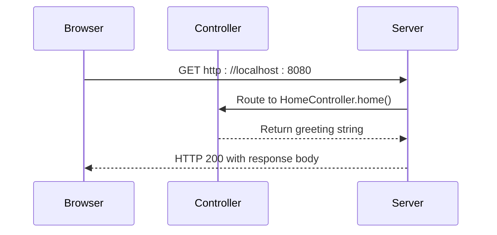

# Development Setup Guide

<cite>
**Referenced Files in This Document**   
- [build.gradle](file://build.gradle)
- [settings.gradle](file://settings.gradle)
- [DemoApplication.kt](file://src/main/kotlin/com/example/demo/DemoApplication.kt)
- [Controller.kt](file://src/main/kotlin/com/example/demo/controllers/Controller.kt)
- [application.properties](file://src/main/resources/application.properties)
</cite>

## Table of Contents
1. [Introduction](#introduction)
2. [Prerequisites](#prerequisites)
3. [Cloning and Project Setup](#cloning-and-project-setup)
4. [Importing the Gradle Project](#importing-the-gradle-project)
5. [Running the Application](#running-the-application)
6. [Accessing the Application](#accessing-the-application)
7. [Modifying the Greeting Message](#modifying-the-greeting-message)
8. [Adding New Endpoints and Controllers](#adding-new-endpoints-and-controllers)
9. [Troubleshooting Common Issues](#troubleshooting-common-issues)
10. [IDE-Specific Guidance](#ide-specific-guidance)
11. [Environment Configuration](#environment-configuration)

## Introduction
This guide provides comprehensive instructions for setting up a local development environment for the Spring Boot Kotlin demo application. It covers all necessary prerequisites, setup steps, execution methods, and customization options to help developers get started quickly and efficiently.

## Prerequisites
Before beginning development, ensure the following prerequisites are installed and configured:

- **JDK 21**: The project is configured to use Java 21 via the toolchain specification in `build.gradle`. Verify installation with `java -version`.
- **Gradle 8.x**: The project uses Gradle as its build system. The included Gradle Wrapper (`gradlew`) ensures compatibility with Gradle 8.x.
- **Kotlin Plugin**: Required for Kotlin compilation and IDE support. This is already declared in the `build.gradle` file.
- **IDE with Spring Boot Support**: Recommended IDEs include IntelliJ IDEA (with Spring Boot and Kotlin plugins) or VS Code (with appropriate extensions for Kotlin and Spring development).

**Section sources**
- [build.gradle](file://build.gradle#L5-L10)

## Cloning and Project Setup
To begin development, clone the repository from its source control system:

```bash
git clone <repository-url>
cd demo
```

The project structure follows standard Spring Boot conventions with Kotlin source files located in `src/main/kotlin/com/example/demo`. The Gradle Wrapper scripts (`gradlew` and `gradlew.bat`) are included, eliminating the need for a global Gradle installation.

**Section sources**
- [build.gradle](file://build.gradle#L1-L52)
- [settings.gradle](file://settings.gradle#L1-L2)

## Importing the Gradle Project
After cloning, import the project into your preferred IDE:

1. Open your IDE and select "Import Project" or "Open"
2. Navigate to the project root directory containing `build.gradle`
3. Select the `build.gradle` file for import
4. Allow the IDE to automatically detect and configure the Gradle project
5. Wait for dependency resolution and indexing to complete

The IDE will recognize the Spring Boot application structure and configure Kotlin compilation based on the plugins declared in the build script.

**Section sources**
- [build.gradle](file://build.gradle#L1-L10)
- [DemoApplication.kt](file://src/main/kotlin/com/example/demo/DemoApplication.kt#L1-L12)

## Running the Application
The application can be started using either the Gradle Wrapper or directly from the IDE:

### Using Gradle Wrapper
Execute the following command from the project root:
```bash
./gradlew bootRun
```

### Using IDE
Run the `main` method in `DemoApplication.kt` directly from the IDE. Most Spring Boot-aware IDEs will recognize the `@SpringBootApplication` annotation and provide run configurations automatically.

The application will start on port 8080 by default, as specified by Spring Boot's default configuration.

**Section sources**
- [build.gradle](file://build.gradle#L48-L50)
- [DemoApplication.kt](file://src/main/kotlin/com/example/demo/DemoApplication.kt#L9-L12)

## Accessing the Application
Once the application is running, access the root endpoint at:

```
http://localhost:8080
```

This will return the greeting message defined in the `HomeController`. The endpoint is mapped using the `@GetMapping("/")` annotation on the `home()` method.



**Diagram sources**
- [Controller.kt](file://src/main/kotlin/com/example/demo/controllers/Controller.kt#L8-L9)
- [DemoApplication.kt](file://src/main/kotlin/com/example/demo/DemoApplication.kt#L6)

## Modifying the Greeting Message
To customize the greeting message:

1. Open `Controller.kt` in the `src/main/kotlin/com/example/demo/controllers/` directory
2. Locate the `home()` method that returns the current greeting string
3. Modify the return string to your desired message
4. Save the file

If `spring-boot-devtools` is active (included in dependencies), the application will automatically restart, and the changes will be visible immediately upon refreshing the browser.

```mermaid
flowchart TD
A[Open Controller.kt] --> B[Locate home() method]
B --> C[Modify return string]
C --> D[Save file]
D --> E{DevTools active?}
E --> |Yes| F[Auto-restart application]
E --> |No| G[Manual restart required]
F --> H[Refresh browser to see changes]
G --> H
```

**Diagram sources**
- [Controller.kt](file://src/main/kotlin/com/example/demo/controllers/Controller.kt#L8-L9)
- [build.gradle](file://build.gradle#L38)

**Section sources**
- [Controller.kt](file://src/main/kotlin/com/example/demo/controllers/Controller.kt#L1-L12)

## Adding New Endpoints and Controllers
To add new REST endpoints:

1. Create a new Kotlin class in the `controllers` package
2. Annotate the class with `@RestController`
3. Define methods with appropriate `@GetMapping`, `@PostMapping`, or other mapping annotations
4. Return data directly or use ResponseEntity for more control

Alternatively, add methods to existing controllers. Each method should be annotated with a request mapping annotation specifying the endpoint path.

**Section sources**
- [Controller.kt](file://src/main/kotlin/com/example/demo/controllers/Controller.kt#L1-L12)

## Troubleshooting Common Issues
### Port Conflicts
If port 8080 is already in use, modify the `application.properties` file to use a different port:
```properties
server.port=8081
```

### Missing JDK
Ensure JDK 21 is installed and JAVA_HOME is correctly set. The build will fail if the correct Java version is not available.

### Gradle Sync Failures
- Verify internet connectivity for dependency downloads
- Check that the Gradle Wrapper scripts have execute permissions
- Clear Gradle cache if corrupted: `./gradlew --stop` followed by deleting `~/.gradle/caches/`

### Kotlin Compilation Errors
Ensure the Kotlin plugin version in `build.gradle` matches the IDE's Kotlin plugin version.

**Section sources**
- [build.gradle](file://build.gradle#L12-L15)
- [application.properties](file://src/main/resources/application.properties#L1)

## IDE-Specific Guidance
### IntelliJ IDEA
- Install Kotlin and Spring Boot plugins
- Enable annotation processing in Settings > Build > Compiler > Annotation Processors
- Use "Import Gradle Project" for automatic configuration
- Run configurations are automatically detected for classes with `main` methods

### VS Code
- Install extensions: "Extension Pack for Java", "Spring Boot Tools", and "Kotlin"
- Use the Command Palette to import Gradle projects
- Configure Java runtime to JDK 21 in settings
- Utilize the Spring Boot Dashboard for managing the application

**Section sources**
- [build.gradle](file://build.gradle#L1-L10)
- [DemoApplication.kt](file://src/main/kotlin/com/example/demo/DemoApplication.kt#L9-L12)

## Environment Configuration
The `application.properties` file in `src/main/resources` controls application settings. Common configurations include:

- Server port: `server.port=8080`
- Application name: `spring.application.name=demo`
- Logging levels: `logging.level.com.example=DEBUG`

For different environments, create profile-specific properties files (e.g., `application-dev.properties`, `application-prod.properties`) and activate them via `spring.profiles.active` property.

**Section sources**
- [application.properties](file://src/main/resources/application.properties#L1)
- [build.gradle](file://build.gradle#L38)