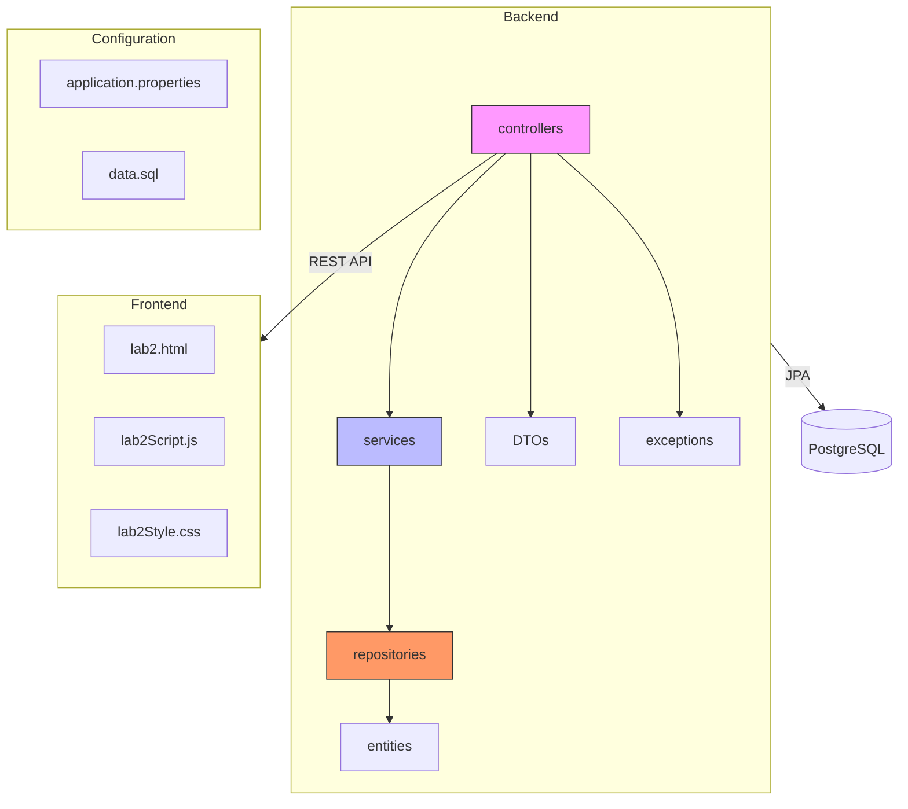
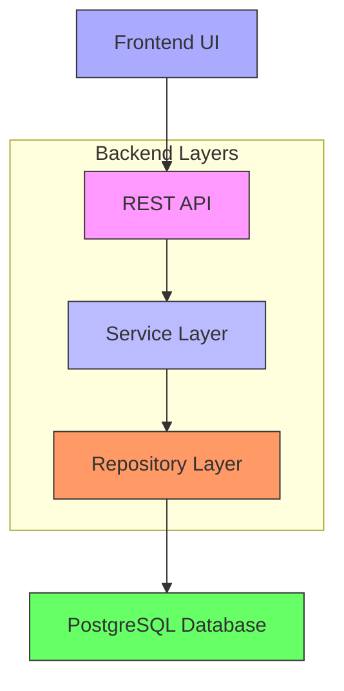
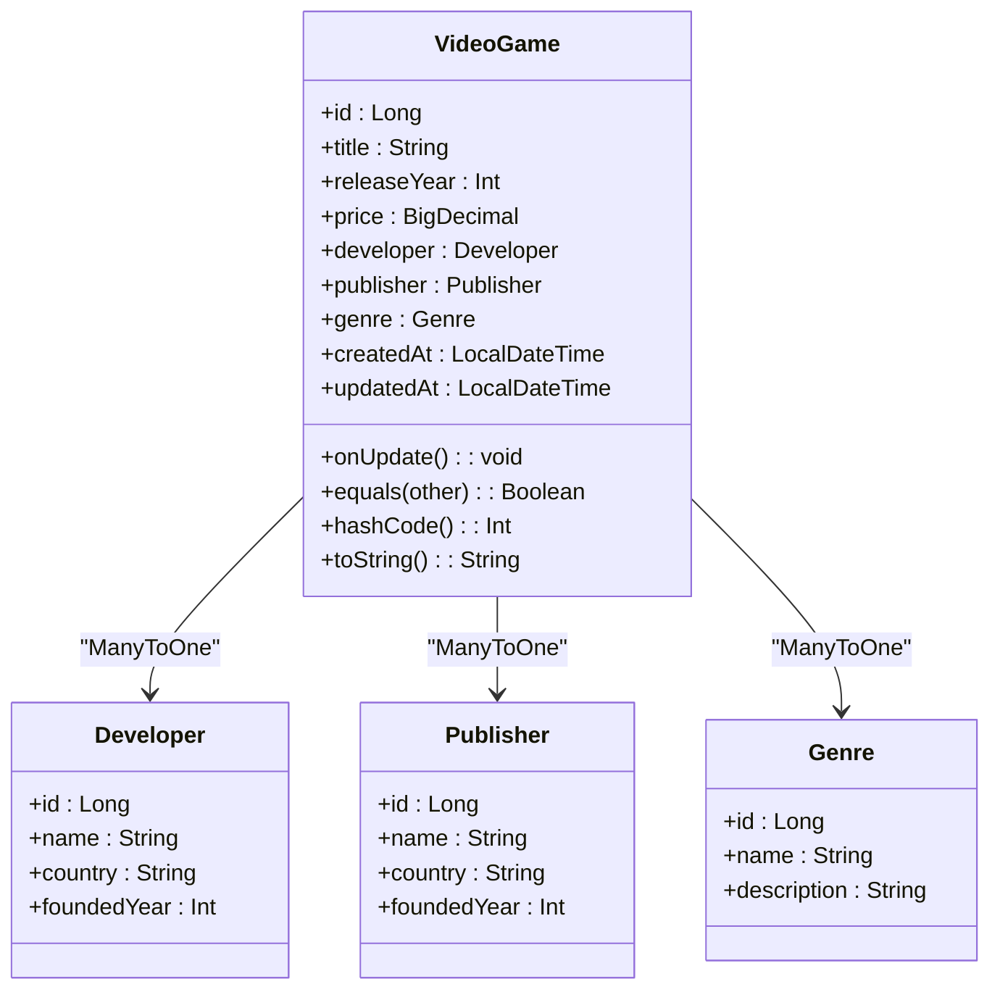
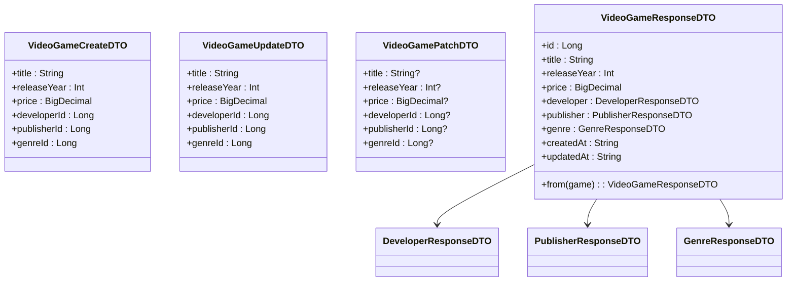
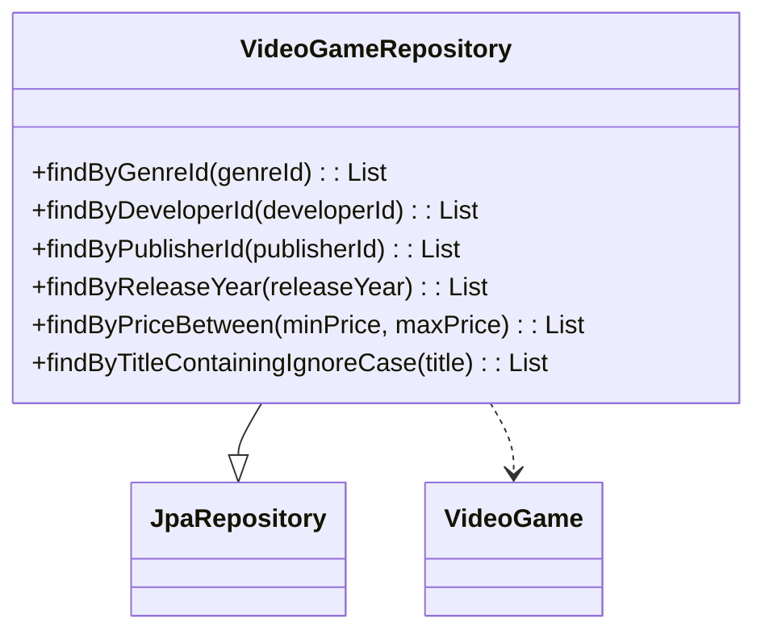
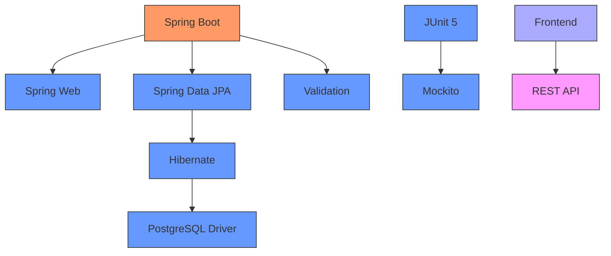

# Lab2: Video Games Database Management

<cite>
**Referenced Files in This Document**   
- [VideoGame.kt](file://src/main/kotlin/com/example/demo/Lab2/entities/VideoGame.kt)
- [VideoGameDTO.kt](file://src/main/kotlin/com/example/demo/Lab2/dto/VideoGameDTO.kt)
- [VideoGameRepository.kt](file://src/main/kotlin/com/example/demo/Lab2/repositories/VideoGameRepository.kt)
- [application.properties](file://src/main/resources/application.properties)
- [Lab2_README.md](file://Lab2_README.md)
- [Lab2_IMPLEMENTATION_SUMMARY.md](file://Lab2_IMPLEMENTATION_SUMMARY.md)
- [Lab2_COMPLETE_GUIDE.md](file://Lab2_COMPLETE_GUIDE.md)
- [DemoApplication.kt](file://src/main/kotlin/com/example/demo/DemoApplication.kt)
</cite>

## Table of Contents
1. [Introduction](#introduction)
2. [Project Structure](#project-structure)
3. [Core Components](#core-components)
4. [Architecture Overview](#architecture-overview)
5. [Detailed Component Analysis](#detailed-component-analysis)
6. [Dependency Analysis](#dependency-analysis)
7. [Performance Considerations](#performance-considerations)
8. [Troubleshooting Guide](#troubleshooting-guide)
9. [Conclusion](#conclusion)

## Introduction
The Lab2 Video Games Database Management System is a comprehensive REST API application designed to manage a video game catalog. Built using Spring Boot, Kotlin, and PostgreSQL, it enables full CRUD operations for video games, developers, publishers, and genres with persistent data storage. The system follows a layered architecture, ensuring separation of concerns and maintainability. It supports advanced querying, filtering, validation, and error handling, making it suitable for production-grade applications. This documentation provides a detailed overview of its implementation, API interfaces, integration patterns, practical usage examples, and troubleshooting guidance.

## Project Structure
The project follows a standard Spring Boot structure with a clear separation of concerns across layers. The Lab2 module is organized into distinct packages for controllers, services, repositories, entities, DTOs, and exceptions. Static frontend assets are stored in the resources directory, while configuration files and initialization scripts support database setup and application behavior.

**Diagram sources**
- [VideoGame.kt](file://src/main/kotlin/com/example/demo/Lab2/entities/VideoGame.kt)
- [application.properties](file://src/main/resources/application.properties)

**Section sources**
- [Lab2_README.md](file://Lab2_README.md#L1-L340)
- [Lab2_IMPLEMENTATION_SUMMARY.md](file://Lab2_IMPLEMENTATION_SUMMARY.md#L1-L280)

## Core Components
The core components of the Lab2 system include JPA entities representing video games, developers, publishers, and genres; DTOs for API contracts; repositories for data access; services for business logic; and controllers for REST endpoints. These components work together to provide a robust, scalable, and maintainable solution for managing video game data with full persistence and validation.

**Section sources**
- [VideoGame.kt](file://src/main/kotlin/com/example/demo/Lab2/entities/VideoGame.kt#L1-L63)
- [VideoGameDTO.kt](file://src/main/kotlin/com/example/demo/Lab2/dto/VideoGameDTO.kt#L1-L112)
- [VideoGameRepository.kt](file://src/main/kotlin/com/example/demo/Lab2/repositories/VideoGameRepository.kt#L1-L44)

## Architecture Overview
The Lab2 system follows a layered architecture pattern, separating concerns across four main layers: controllers (REST API), services (business logic), repositories (data access), and entities (persistent data models). This design promotes modularity, testability, and maintainability. The frontend communicates with the backend via RESTful endpoints, while the backend interacts with PostgreSQL through Spring Data JPA and Hibernate.

**Diagram sources**
- [Lab2_README.md](file://Lab2_README.md#L1-L340)
- [DemoApplication.kt](file://src/main/kotlin/com/example/demo/DemoApplication.kt#L1-L12)

## Detailed Component Analysis

### Video Game Entity Analysis
The `VideoGame` entity represents the central data model in the system, containing fields for title, release year, price, and relationships to developer, publisher, and genre. It uses JPA annotations for persistence, including automatic ID generation, foreign key constraints, and timestamp management. The entity implements proper equality and hashing based on the ID, ensuring correct behavior in collections.

**Diagram sources**
- [VideoGame.kt](file://src/main/kotlin/com/example/demo/Lab2/entities/VideoGame.kt#L1-L63)

**Section sources**
- [VideoGame.kt](file://src/main/kotlin/com/example/demo/Lab2/entities/VideoGame.kt#L1-L63)

### Video Game DTO Analysis
The system uses multiple DTOs to define API contracts for video games, including `VideoGameCreateDTO`, `VideoGameUpdateDTO`, `VideoGamePatchDTO`, and `VideoGameResponseDTO`. These DTOs provide type safety, validation, and separation between internal entity models and external API representations. The response DTO includes nested DTOs for related entities, enabling rich data retrieval without exposing internal structures.

**Diagram sources**
- [VideoGameDTO.kt](file://src/main/kotlin/com/example/demo/Lab2/dto/VideoGameDTO.kt#L1-L112)

**Section sources**
- [VideoGameDTO.kt](file://src/main/kotlin/com/example/demo/Lab2/dto/VideoGameDTO.kt#L1-L112)

### Video Game Repository Analysis
The `VideoGameRepository` interface extends Spring Data JPA's `JpaRepository`, providing built-in CRUD operations while adding custom query methods for filtering. These include methods to find games by genre, developer, publisher, release year, price range, and title substring (case-insensitive). This enables flexible querying capabilities without requiring manual SQL implementation.

**Diagram sources**
- [VideoGameRepository.kt](file://src/main/kotlin/com/example/demo/Lab2/repositories/VideoGameRepository.kt#L1-L44)

**Section sources**
- [VideoGameRepository.kt](file://src/main/kotlin/com/example/demo/Lab2/repositories/VideoGameRepository.kt#L1-L44)

## Dependency Analysis
The Lab2 system has well-defined dependencies between components, following Spring Boot conventions. The backend depends on Spring Web, Spring Data JPA, Hibernate, and PostgreSQL drivers, while tests use JUnit 5 and Mockito. The frontend is self-contained with HTML, CSS, and JavaScript files that interact with the backend via REST API calls. Configuration is managed through `application.properties`, which defines database connection parameters and JPA behavior.

**Diagram sources**
- [application.properties](file://src/main/resources/application.properties#L1-L15)
- [Lab2_README.md](file://Lab2_README.md#L1-L340)

**Section sources**
- [application.properties](file://src/main/resources/application.properties#L1-L15)
- [Lab2_README.md](file://Lab2_README.md#L1-L340)

## Performance Considerations
The system leverages Spring Data JPA's query optimization features and Hibernate's lazy/eager loading strategies to balance performance and usability. By default, related entities (developer, publisher, genre) are fetched eagerly to avoid N+1 query problems when returning responses. The repository provides indexed search methods for efficient filtering. For production use, additional optimizations like pagination, caching, and database indexing would further enhance performance with large datasets.

## Troubleshooting Guide
Common issues include database connection failures, missing database creation, and port conflicts. Ensure PostgreSQL is running and the `lab2_videogames` database exists. Verify credentials in `application.properties`. If port 8080 is occupied, configure an alternative port. Reference data (genres, developers, publishers) must be created before adding video games, as foreign key constraints prevent orphaned records. The system prevents deletion of entities associated with games to maintain data integrity.

**Section sources**
- [Lab2_README.md](file://Lab2_README.md#L1-L340)
- [Lab2_COMPLETE_GUIDE.md](file://Lab2_COMPLETE_GUIDE.md#L1-L323)

## Conclusion
The Lab2 Video Games Database Management System provides a robust, production-ready solution for managing video game catalogs with full CRUD operations, data persistence, and comprehensive error handling. Its layered architecture, use of modern technologies, and thorough documentation make it an excellent example of Spring Boot application design. The system successfully addresses the limitations of its predecessor (Lab1) by introducing persistent storage, relational data modeling, transaction management, and advanced querying capabilities. With complete test coverage and a user-friendly frontend, it serves as both a practical tool and an educational resource for learning Spring Boot, Kotlin, and PostgreSQL integration.