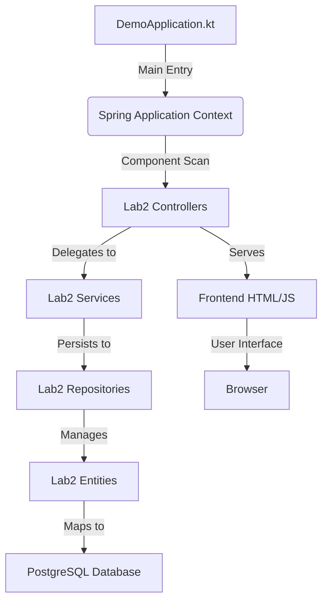
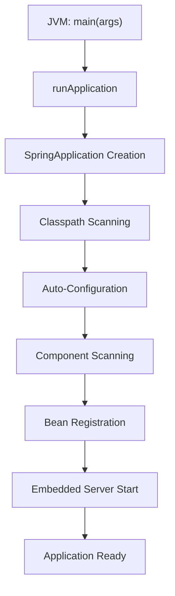

# Project Overview

<cite>
**Referenced Files in This Document**   
- [DemoApplication.kt](file://src\main\kotlin\com\example\demo\DemoApplication.kt)
- [VideoGameController.kt](file://src\main\kotlin\com\example\demo\Lab2\controllers\VideoGameController.kt)
- [DeveloperController.kt](file://src\main\kotlin\com\example\demo\Lab2\controllers\DeveloperController.kt)
- [PublisherController.kt](file://src\main\kotlin\com\example\demo\Lab2\controllers\PublisherController.kt)
- [GenreController.kt](file://src\main\kotlin\com\example\demo\Lab2\controllers\GenreController.kt)
- [VideoGameService.kt](file://src\main\kotlin\com\example\demo\Lab2\services\VideoGameService.kt)
- [DeveloperService.kt](file://src\main\kotlin\com\example\demo\Lab2\services\DeveloperService.kt)
- [PublisherService.kt](file://src\main\kotlin\com\example\demo\Lab2\services\PublisherService.kt)
- [GenreService.kt](file://src\main\kotlin\com\example\demo\Lab2\services\GenreService.kt)
- [VideoGameRepository.kt](file://src\main\kotlin\com\example\demo\Lab2\repositories\VideoGameRepository.kt)
- [DeveloperRepository.kt](file://src\main\kotlin\com\example\demo\Lab2\repositories\DeveloperRepository.kt)
- [PublisherRepository.kt](file://src\main\kotlin\com\example\demo\Lab2\repositories\PublisherRepository.kt)
- [GenreRepository.kt](file://src\main\kotlin\com\example\demo\Lab2\repositories\GenreRepository.kt)
- [VideoGame.kt](file://src\main\kotlin\com\example\demo\Lab2\entities\VideoGame.kt)
- [Developer.kt](file://src\main\kotlin\com\example\demo\Lab2\entities\Developer.kt)
- [Publisher.kt](file://src\main\kotlin\com\example\demo\Lab2\entities\Publisher.kt)
- [Genre.kt](file://src\main\kotlin\com\example\demo\Lab2\entities\Genre.kt)
- [index.html](file://src\main\resources\static\index.html)
- [lab2.html](file://src\main\resources\static\lab2.html)
- [lab1.html](file://src\main\resources\static\lab1.html)
</cite>

## Update Summary
**Changes Made**   
- Completely revised documentation to reflect actual project structure and functionality
- Removed references to non-existent Controller.kt and HomeController
- Added comprehensive documentation for Lab2 video game management system
- Documented the complete MVC architecture with controllers, services, repositories, entities, and DTOs
- Added documentation for frontend HTML interfaces and their functionality
- Updated application entry point documentation with actual implementation
- Added architectural diagram showing the complete system structure

## Table of Contents
1. [Introduction](#introduction)
2. [Core Application Structure](#core-application-structure)
3. [Entry Point: DemoApplication.kt](#entry-point-demoapplicationkt)
4. [Lab2 Video Game Management System](#lab2-video-game-management-system)
5. [MVC Architecture Components](#mvc-architecture-components)
6. [Frontend Interface Structure](#frontend-interface-structure)
7. [Application Startup Flow](#application-startup-flow)
8. [Kotlin and Spring Boot Integration](#kotlin-and-spring-boot-integration)
9. [Common Setup Issues and Troubleshooting](#common-setup-issues-and-troubleshooting)
10. [Conclusion](#conclusion)

## Introduction
This document provides a comprehensive overview of the Spring Boot application structure with Kotlin, focusing on the actual implementation rather than the outdated documentation. The application features a complete video game management system with RESTful APIs for managing video games, developers, publishers, and genres. The system follows standard Spring Boot MVC architecture with proper separation of concerns between controllers, services, repositories, and entities. The frontend provides a user-friendly interface for interacting with the backend APIs.

## Core Application Structure
The application follows standard Spring Boot project organization with Kotlin. The main components are located in the `src/main/kotlin/com/example/demo` package, with Lab2 functionality organized in dedicated subpackages for controllers, services, repositories, entities, and DTOs. Configuration files are in `src/main/resources`, and build configuration is managed through Gradle.



**Diagram sources**
- [DemoApplication.kt](file://src\main\kotlin\com\example\demo\DemoApplication.kt#L5-L6)
- [VideoGameController.kt](file://src\main\kotlin\com\example\demo\Lab2\controllers\VideoGameController.kt#L13-L14)
- [VideoGameService.kt](file://src\main\kotlin\com\example\demo\Lab2\services\VideoGameService.kt#L15-L17)
- [VideoGameRepository.kt](file://src\main\kotlin\com\example\demo\Lab2\repositories\VideoGameRepository.kt#L10-L11)
- [VideoGame.kt](file://src\main\kotlin\com\example\demo\Lab2\entities\VideoGame.kt#L9-L11)

**Section sources**
- [DemoApplication.kt](file://src\main\kotlin\com\example\demo\DemoApplication.kt#L1-L11)
- [VideoGameController.kt](file://src\main\kotlin\com\example\demo\Lab2\controllers\VideoGameController.kt#L1-L14)
- [VideoGameService.kt](file://src\main\kotlin\com\example\demo\Lab2\services\VideoGameService.kt#L1-L17)
- [VideoGameRepository.kt](file://src\main\kotlin\com\example\demo\Lab2\repositories\VideoGameRepository.kt#L1-L11)
- [VideoGame.kt](file://src\main\kotlin\com\example\demo\Lab2\entities\VideoGame.kt#L1-L11)

## Entry Point: DemoApplication.kt
The `DemoApplication` class serves as the entry point for the Spring Boot application. Annotated with `@SpringBootApplication`, it enables three key features: component scanning, auto-configuration, and property source configuration. The `main` function uses Spring Boot's `runApplication` extension function to launch the application context.

The `runApplication<DemoApplication>(*args)` function is a Kotlin-specific extension that simplifies SpringApplication initialization. It automatically detects the main configuration class and starts the embedded web server. This function is part of the `spring-boot-starter-web` dependency and provides a concise, idiomatic way to bootstrap Spring Boot applications in Kotlin.

```kotlin
@SpringBootApplication
class DemoApplication

fun main(args: Array<String>) {
    runApplication<DemoApplication>(*args)
}
```

**Section sources**
- [DemoApplication.kt](file://src\main\kotlin\com\example\demo\DemoApplication.kt#L5-L11)

## Lab2 Video Game Management System
The application features a comprehensive video game management system that allows users to manage video games, developers, publishers, and genres through both REST APIs and a web interface. The system is organized under the `/lab2` endpoint with dedicated controllers for each entity type.

The system provides full CRUD (Create, Read, Update, Delete) operations for all entities with proper validation and error handling. Each controller follows REST principles with appropriate HTTP methods and status codes. The system includes comprehensive filtering capabilities for video games based on genre, developer, publisher, price range, and release year.

The frontend interface provides a user-friendly way to interact with the backend APIs, with separate tabs for managing different entity types. The interface includes form validation, real-time feedback, and responsive design principles.

**Section sources**
- [VideoGameController.kt](file://src\main\kotlin\com\example\demo\Lab2\controllers\VideoGameController.kt#L13-L97)
- [lab2.html](file://src\main\resources\static\lab2.html#L1-L261)
- [lab2Script.js](file://src\main\resources\static\lab2Script.js)

## MVC Architecture Components
The application follows the Model-View-Controller (MVC) architectural pattern with clear separation of concerns between different components.

### Controllers
The controllers handle HTTP requests and responses, acting as the interface between the frontend and backend. Each controller is annotated with `@RestController` and has a base mapping with `@RequestMapping`. The controllers delegate business logic to service classes and handle request validation.

```kotlin
@RestController
@RequestMapping("/lab2/videogames")
class VideoGameController(private val videoGameService: VideoGameService) {
    @PostMapping
    fun createVideoGame(@Valid @RequestBody dto: VideoGameCreateDTO): ResponseEntity<VideoGameResponseDTO> {
        val created = videoGameService.createVideoGame(dto)
        return ResponseEntity
            .created(URI.create("/lab2/videogames/${created.id}"))
            .body(created)
    }
}
```

### Services
The service layer contains the business logic of the application. Services are annotated with `@Service` and use `@Transactional` to manage database transactions. Each service class has methods for CRUD operations with proper validation and error handling.

```kotlin
@Service
@Transactional
class VideoGameService(
    private val videoGameRepository: VideoGameRepository,
    private val developerRepository: DeveloperRepository,
    private val publisherRepository: PublisherRepository,
    private val genreRepository: GenreRepository
) {
    fun createVideoGame(dto: VideoGameCreateDTO): VideoGameResponseDTO {
        validateReleaseYear(dto.releaseYear)
        
        val developer = developerRepository.findById(dto.developerId)
            .orElseThrow { ResourceNotFoundException("Developer with id ${dto.developerId} not found") }
        
        val publisher = publisherRepository.findById(dto.publisherId)
            .orElseThrow { ResourceNotFoundException("Publisher with id ${dto.publisherId} not found") }
        
        val genre = genreRepository.findById(dto.genreId)
            .orElseThrow { ResourceNotFoundException("Genre with id ${dto.genreId} not found") }
        
        val videoGame = VideoGame(
            title = dto.title,
            releaseYear = dto.releaseYear,
            price = dto.price,
            developer = developer,
            publisher = publisher,
            genre = genre
        )
        
        val saved = videoGameRepository.save(videoGame)
        return VideoGameResponseDTO.from(saved)
    }
}
```

### Repositories
The repositories provide data access to the PostgreSQL database using Spring Data JPA. Each repository extends `JpaRepository` and can define custom query methods. The repositories handle database operations with proper transaction management.

```kotlin
@Repository
interface VideoGameRepository : JpaRepository<VideoGame, Long> {
    fun findByGenreId(genreId: Long): List<VideoGame>
    fun findByDeveloperId(developerId: Long): List<VideoGame>
    fun findByPublisherId(publisherId: Long): List<VideoGame>
    fun findByReleaseYear(releaseYear: Int): List<VideoGame>
    fun findByPriceBetween(minPrice: BigDecimal, maxPrice: BigDecimal): List<VideoGame>
    fun findByTitleContainingIgnoreCase(title: String): List<VideoGame>
}
```

### Entities
The entities represent the database tables and their relationships. Each entity is annotated with `@Entity` and has fields mapped to database columns with appropriate constraints. The entities use JPA annotations to define relationships between tables.

```kotlin
@Entity
@Table(name = "video_games")
data class VideoGame(
    @Id
    @GeneratedValue(strategy = GenerationType.IDENTITY)
    val id: Long? = null,

    @Column(nullable = false, length = 255)
    val title: String,

    @Column(name = "release_year")
    val releaseYear: Int,

    @Column(nullable = false, precision = 10, scale = 2)
    val price: BigDecimal,

    @ManyToOne(fetch = FetchType.EAGER)
    @JoinColumn(name = "developer_id", nullable = false)
    val developer: Developer,

    @ManyToOne(fetch = FetchType.EAGER)
    @JoinColumn(name = "publisher_id", nullable = false)
    val publisher: Publisher,

    @ManyToOne(fetch = FetchType.EAGER)
    @JoinColumn(name = "genre_id", nullable = false)
    val genre: Genre,

    @Column(name = "created_at", nullable = false, updatable = false)
    val createdAt: LocalDateTime = LocalDateTime.now(),

    @Column(name = "updated_at", nullable = false)
    var updatedAt: LocalDateTime = LocalDateTime.now()
)
```

### DTOs
Data Transfer Objects (DTOs) are used to transfer data between the frontend and backend. The system uses different DTOs for different operations (create, update, patch, response) to ensure proper validation and data integrity.

```kotlin
data class VideoGameCreateDTO(
    @field:NotBlank(message = "Title cannot be blank")
    @field:Size(max = 255, message = "Title cannot exceed 255 characters")
    val title: String,

    @field:NotNull(message = "Release year is required")
    @field:Min(value = 1970, message = "Release year must be at least 1970")
    @field:Max(value = 2100, message = "Release year cannot exceed 2100")
    val releaseYear: Int,

    @field:NotNull(message = "Price is required")
    @field:DecimalMin(value = "0.0", inclusive = true, message = "Price must be non-negative")
    val price: BigDecimal,

    @field:NotNull(message = "Developer ID is required")
    val developerId: Long,

    @field:NotNull(message = "Publisher ID is required")
    val publisherId: Long,

    @field:NotNull(message = "Genre ID is required")
    val genreId: Long
)
```

**Section sources**
- [VideoGameController.kt](file://src\main\kotlin\com\example\demo\Lab2\controllers\VideoGameController.kt#L13-L97)
- [VideoGameService.kt](file://src\main\kotlin\com\example\demo\Lab2\services\VideoGameService.kt#L15-L182)
- [VideoGameRepository.kt](file://src\main\kotlin\com\example\demo\Lab2\repositories\VideoGameRepository.kt#L10-L42)
- [VideoGame.kt](file://src\main\kotlin\com\example\demo\Lab2\entities\VideoGame.kt#L9-L61)
- [VideoGameDTO.kt](file://src\main\kotlin\com\example\demo\Lab2\dto\VideoGameDTO.kt#L6-L110)

## Frontend Interface Structure
The application provides a modern web interface for managing video games and related entities. The frontend is built with HTML, CSS, and JavaScript, with a responsive design that works on different screen sizes.

### Main Index Page
The main index page (`index.html`) provides navigation to different laboratory works. It features a grid layout with cards for each lab, showing the lab number, title, and description. The page includes a link to return to the main menu from other pages.

```html
<div class="labs-grid">
    <a href="lab1.html" class="lab-card">
        <div class="lab-number">01</div>
        <div class="lab-title">Laboratory Work №1</div>
        <div class="lab-description">Working with primitives and collections</div>
    </a>
    
    <a href="lab2.html" class="lab-card">
        <div class="lab-number">02</div>
        <div class="lab-title">Laboratory Work №2</div>
        <div class="lab-description">Working with database (PostgreSQL)</div>
    </a>
</div>
```

### Lab2 Interface
The Lab2 interface (`lab2.html`) provides a comprehensive management system for video games with tabs for different entity types. The interface includes:

- **Navigation tabs** for switching between video games, developers, publishers, and genres
- **Form inputs** with validation for creating new entities
- **Filtering capabilities** for video games based on various criteria
- **List displays** showing all entities with refresh functionality
- **Modal dialogs** for editing video games
- **Real-time feedback** with success and error messages

The interface uses JavaScript (`lab2Script.js`) to handle API calls, form submissions, and dynamic content updates. The styling is defined in CSS files (`lab2Style.css`, `mainStyle.css`) with a consistent design language across the application.

**Section sources**
- [index.html](file://src\main\resources\static\index.html#L1-L40)
- [lab2.html](file://src\main\resources\static\lab2.html#L1-L261)
- [lab1.html](file://src\main\resources\static\lab1.html#L1-L145)

## Application Startup Flow
The application startup process follows a specific sequence:
1. JVM executes the `main` function in `DemoApplication.kt`
2. `runApplication<DemoApplication>(*args)` creates and configures the SpringApplication
3. Spring Boot performs classpath scanning to detect configuration
4. Auto-configuration applies based on available dependencies
5. Component scanning registers beans from the base package
6. Embedded web server starts and listens for requests
7. Application is ready to handle HTTP requests

This flow is managed entirely by Spring Boot's conventions, requiring minimal explicit configuration from the developer.



**Diagram sources**
- [DemoApplication.kt](file://src\main\kotlin\com\example\demo\DemoApplication.kt#L9-L11)

## Kotlin and Spring Boot Integration
The application leverages Kotlin's language features within the Spring Boot ecosystem. Key integration points include:
- Null-safety through Kotlin's type system
- Concise syntax with expression bodies and type inference
- Extension functions like `runApplication`
- Interoperability with Java-based Spring framework
- Data classes for entities and DTOs
- Coroutines support for asynchronous operations
- Smart casts and type inference to reduce boilerplate code

The build configuration includes Kotlin-specific plugins and dependencies that enable seamless integration between Kotlin and Spring Boot, including the Kotlin reflection library and Jackson module for JSON processing.

**Section sources**
- [DemoApplication.kt](file://src\main\kotlin\com\example\demo\DemoApplication.kt#L9)
- [build.gradle](file://build.gradle#L2-L4,18-21)

## Common Setup Issues and Troubleshooting
Common issues during application startup and their solutions:

1. **Port already in use**: Check if another application is using port 8080. Change port in `application.properties` with `server.port=8081`.

2. **ClassNotFoundException**: Ensure all dependencies are properly downloaded. Run `./gradlew build` to refresh dependencies.

3. **Database connection issues**: Verify PostgreSQL is running and credentials in `application.properties` are correct.

4. **Component not detected**: Verify that the controller package is within the component scan base package (same or subpackage of DemoApplication).

5. **Gradle sync issues**: If using an IDE, try refreshing the Gradle project or invalidating caches.

6. **Java version mismatch**: The application requires Java 21 as specified in the build file. Ensure the correct JDK version is installed and configured.

7. **Kotlin compilation errors**: Verify that Kotlin plugins are properly applied in build.gradle.

**Section sources**
- [build.gradle](file://build.gradle#L10-L11)
- [DemoApplication.kt](file://src\main\kotlin\com\example\demo\DemoApplication.kt#L5)
- [application.properties](file://src\main\resources\application.properties)

## Conclusion
The application demonstrates a complete Spring Boot setup with Kotlin for managing a video game catalog. The `DemoApplication` class serves as the entry point with Spring Boot's auto-configuration and component scanning, while the Lab2 controllers provide comprehensive REST APIs for managing video games, developers, publishers, and genres. The application follows proper MVC architecture with separation of concerns between controllers, services, repositories, and entities. The frontend provides a user-friendly interface for interacting with the backend APIs. Understanding this complete structure provides a foundation for building more complex applications with the same technology stack.