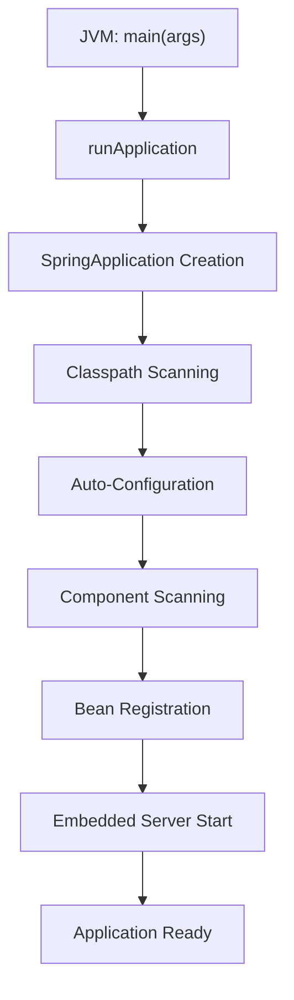
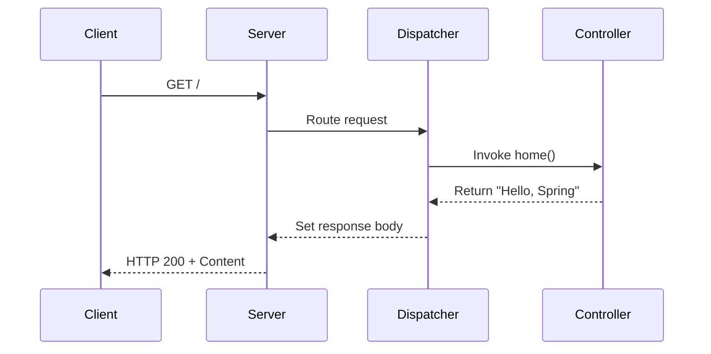

# Project Overview

<cite>
**Referenced Files in This Document**   
- [DemoApplication.kt](file://src/main/kotlin/com/example/demo/DemoApplication.kt)
- [Controller.kt](file://src/main/kotlin/com/example/demo/controllers/Controller.kt)
- [application.properties](file://src/main/resources/application.properties)
- [build.gradle](file://build.gradle)
</cite>

## Table of Contents
1. [Introduction](#introduction)
2. [Core Application Structure](#core-application-structure)
3. [Entry Point: DemoApplication.kt](#entry-point-demoapplicationkt)
4. [REST Controller: HomeController](#rest-controller-homecontroller)
5. [Component Scanning and Auto-Configuration](#component-scanning-and-auto-configuration)
6. [Application Startup Flow](#application-startup-flow)
7. [Request Handling Process](#request-handling-process)
8. [Kotlin and Spring Boot Integration](#kotlin-and-spring-boot-integration)
9. [Common Setup Issues and Troubleshooting](#common-setup-issues-and-troubleshooting)
10. [Conclusion](#conclusion)

## Introduction
This document provides a comprehensive overview of the Spring Boot application structure with Kotlin. It explains how the application is initialized, how HTTP requests are handled, and the relationship between core components. The explanation is designed to be accessible for beginners while providing technical depth for developers working with the codebase.

## Core Application Structure
The application follows standard Spring Boot project organization with Kotlin. The main components are located in the `src/main/kotlin/com/example/demo` package, with controllers separated into their own subpackage. Configuration files are in `src/main/resources`, and build configuration is managed through Gradle.

```mermaid
graph TD
A[DemoApplication.kt] --> |Main Entry| B(Spring Application Context)
B --> |Component Scan| C[Controller.kt]
C --> |Handles| D[HTTP Request /]
D --> |Returns| E[HTTP Response "Hello, Spring"]
```

**Diagram sources**
- [DemoApplication.kt](file://src/main/kotlin/com/example/demo/DemoApplication.kt#L5-L11)
- [Controller.kt](file://src/main/kotlin/com/example/demo/controllers/Controller.kt#L5-L10)

**Section sources**
- [DemoApplication.kt](file://src/main/kotlin/com/example/demo/DemoApplication.kt#L1-L11)
- [Controller.kt](file://src/main/kotlin/com/example/demo/controllers/Controller.kt#L1-L11)

## Entry Point: DemoApplication.kt
The `DemoApplication` class serves as the entry point for the Spring Boot application. Annotated with `@SpringBootApplication`, it enables three key features: component scanning, auto-configuration, and property source configuration. The `main` function uses Spring Boot's `runApplication` extension function to launch the application context.

The `runApplication<DemoApplication>(*args)` function is a Kotlin-specific extension that simplifies SpringApplication initialization. It automatically detects the main configuration class and starts the embedded web server. This function is part of the `spring-boot-starter-web` dependency and provides a concise, idiomatic way to bootstrap Spring Boot applications in Kotlin.

**Section sources**
- [DemoApplication.kt](file://src/main/kotlin/com/example/demo/DemoApplication.kt#L5-L11)
- [build.gradle](file://build.gradle#L18)

## REST Controller: HomeController
The `HomeController` class is a REST controller that handles HTTP requests. Marked with the `@RestController` annotation, it combines `@Controller` and `@ResponseBody`, indicating that all handler methods return domain objects directly serialized to JSON (or in this case, plain text).

The controller exposes a single endpoint at the root path (`/`) using the `@GetMapping` annotation. When a GET request is received, the `home()` method returns a greeting string. The method uses Kotlin's expression body syntax (`=`) for conciseness, which is equivalent to a method with a return statement.

**Section sources**
- [Controller.kt](file://src/main/kotlin/com/example/demo/controllers/Controller.kt#L5-L10)
- [build.gradle](file://build.gradle#L18)

## Component Scanning and Auto-Configuration
Spring Boot's component scanning automatically detects and registers beans in the application context. Starting from the package of the `@SpringBootApplication` class, it recursively scans for components annotated with `@Component`, `@Controller`, `@Service`, `@Repository`, and related annotations.

Auto-configuration works in conjunction with component scanning to configure the application based on the dependencies present in the classpath. When `spring-boot-starter-web` is detected, Spring Boot automatically configures an embedded Tomcat server, Spring MVC, and related web components. This eliminates the need for manual configuration of common scenarios.

The `application.properties` file contains basic configuration, setting the application name which can be used for service discovery in microservices architectures.

**Section sources**
- [DemoApplication.kt](file://src/main/kotlin/com/example/demo/DemoApplication.kt#L5)
- [application.properties](file://src/main/resources/application.properties#L0)
- [build.gradle](file://build.gradle#L18)

## Application Startup Flow
The application startup process follows a specific sequence:
1. JVM executes the `main` function in `DemoApplication.kt`
2. `runApplication<DemoApplication>(*args)` creates and configures the SpringApplication
3. Spring Boot performs classpath scanning to detect configuration
4. Auto-configuration applies based on available dependencies
5. Component scanning registers beans from the base package
6. Embedded web server starts and listens for requests
7. Application is ready to handle HTTP requests

This flow is managed entirely by Spring Boot's conventions, requiring minimal explicit configuration from the developer.



**Diagram sources**
- [DemoApplication.kt](file://src/main/kotlin/com/example/demo/DemoApplication.kt#L9-L11)

## Request Handling Process
When an HTTP request reaches the application, Spring MVC routes it through a well-defined process:
1. Client sends GET request to `/`
2. DispatcherServlet receives the request
3. HandlerMapping identifies HomeController.home() as the handler
4. HandlerAdapter invokes the home() method
5. Return value is processed as the response body
6. HTTP response with status 200 and content is sent to client

The `@RestController` annotation ensures that the string returned by `home()` is written directly to the response body without view resolution.



**Diagram sources**
- [Controller.kt](file://src/main/kotlin/com/example/demo/controllers/Controller.kt#L7-L10)

## Kotlin and Spring Boot Integration
The application leverages Kotlin's language features within the Spring Boot ecosystem. Key integration points include:
- Null-safety through Kotlin's type system
- Concise syntax with expression bodies and type inference
- Extension functions like `runApplication`
- Interoperability with Java-based Spring framework

The build configuration in `build.gradle` includes Kotlin-specific plugins and dependencies that enable seamless integration between Kotlin and Spring Boot, including the Kotlin reflection library and Jackson module for JSON processing.

**Section sources**
- [DemoApplication.kt](file://src/main/kotlin/com/example/demo/DemoApplication.kt#L9)
- [build.gradle](file://build.gradle#L2-L4,18-21)

## Common Setup Issues and Troubleshooting
Common issues during application startup and their solutions:

1. **Port already in use**: Check if another application is using port 8080. Change port in `application.properties` with `server.port=8081`.

2. **ClassNotFoundException**: Ensure all dependencies are properly downloaded. Run `./gradlew build` to refresh dependencies.

3. **Component not detected**: Verify that the controller package is within the component scan base package (same or subpackage of DemoApplication).

4. **Gradle sync issues**: If using an IDE, try refreshing the Gradle project or invalidating caches.

5. **Java version mismatch**: The application requires Java 21 as specified in the build file. Ensure the correct JDK version is installed and configured.

6. **Kotlin compilation errors**: Verify that Kotlin plugins are properly applied in build.gradle.

**Section sources**
- [build.gradle](file://build.gradle#L10-L11)
- [DemoApplication.kt](file://src/main/kotlin/com/example/demo/DemoApplication.kt#L5)

## Conclusion
The application demonstrates a minimal but complete Spring Boot setup with Kotlin. The `DemoApplication` class serves as the entry point with Spring Boot's auto-configuration and component scanning, while `HomeController` provides a simple REST endpoint. The integration between Kotlin and Spring Boot enables concise, type-safe code with minimal configuration overhead. Understanding this core structure provides a foundation for building more complex applications with the same technology stack.