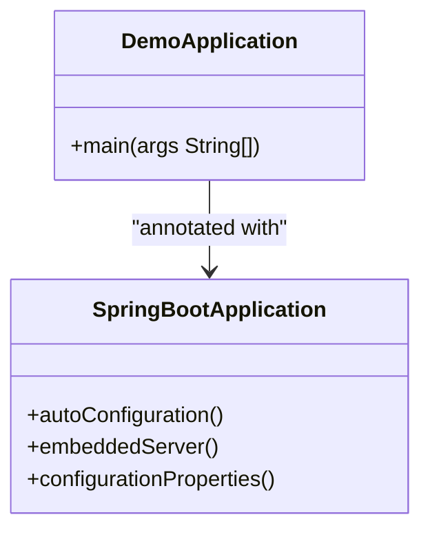
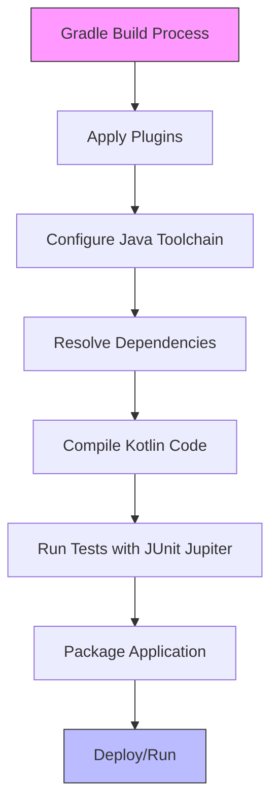
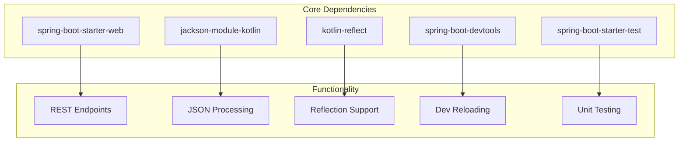
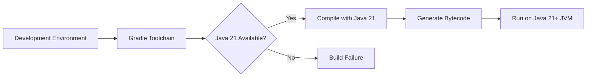

# Technology Stack & Dependencies

<cite>
**Referenced Files in This Document**   
- [build.gradle](file://build.gradle)
- [DemoApplication.kt](file://src/main/kotlin/com/example/demo/DemoApplication.kt)
- [settings.gradle](file://settings.gradle)
</cite>

## Table of Contents
1. [Introduction](#introduction)
2. [Core Framework: Spring Boot 3.5.6](#core-framework-spring-boot-356)
3. [Programming Language: Kotlin 1.9.25](#programming-language-kotlin-1925)
4. [Gradle Build Configuration](#gradle-build-configuration)
5. [Key Dependencies Analysis](#key-dependencies-analysis)
6. [Java Toolchain and Runtime](#java-toolchain-and-runtime)
7. [Dependency Management Strategy](#dependency-management-strategy)
8. [Adding and Modifying Dependencies](#adding-and-modifying-dependencies)
9. [Version Compatibility and Upgrade Guidance](#version-compatibility-and-upgrade-guidance)
10. [Conclusion](#conclusion)

## Introduction
This document provides a comprehensive analysis of the technology stack and dependency management system in the Spring Boot application. It details the foundational components including Spring Boot 3.5.6, Kotlin 1.9.25, and Gradle build configuration. The document explains the purpose of each dependency, the build setup, and provides guidance on managing dependencies effectively.

**Section sources**
- [build.gradle](file://build.gradle#L1-L50)
- [DemoApplication.kt](file://src/main/kotlin/com/example/demo/DemoApplication.kt#L1-L10)

## Core Framework: Spring Boot 3.5.6

Spring Boot 3.5.6 serves as the foundational framework for this application, providing essential capabilities that streamline development and deployment. The framework enables auto-configuration through the `@SpringBootApplication` annotation, which automatically configures the Spring application based on the dependencies present in the classpath. This eliminates the need for extensive XML or Java configuration, allowing developers to focus on business logic rather than infrastructure setup.

The framework also includes an embedded server capability, which allows the application to run as a standalone executable JAR file without requiring external deployment to a servlet container. This is particularly beneficial for microservices architectures and cloud-native applications where simplicity and portability are crucial.

Spring Boot 3.5.6 brings several advantages including production-ready features out of the box (such as health checks, metrics, and externalized configuration), opinionated defaults that follow best practices, and seamless integration with the broader Spring ecosystem.



**Diagram sources**
- [DemoApplication.kt](file://src/main/kotlin/com/example/demo/DemoApplication.kt#L5-L6)
- [build.gradle](file://build.gradle#L3-L3)

**Section sources**
- [DemoApplication.kt](file://src/main/kotlin/com/example/demo/DemoApplication.kt#L5-L6)
- [build.gradle](file://build.gradle#L3-L3)

## Programming Language: Kotlin 1.9.25

The application leverages Kotlin 1.9.25 as the primary programming language, taking advantage of its modern syntax, null safety, and interoperability with Java. The Kotlin JVM plugin (`org.jetbrains.kotlin.jvm`) is configured in the build file to compile Kotlin code for the Java Virtual Machine, while the Kotlin Spring plugin (`org.jetbrains.kotlin.plugin.spring`) provides additional support for Spring Framework features.

Kotlin's concise syntax reduces boilerplate code significantly compared to Java, leading to more maintainable and readable code. The language's null safety features help prevent null pointer exceptions at compile time, improving application reliability. Additionally, Kotlin's extension functions, data classes, and coroutines provide powerful abstractions that enhance developer productivity.

The Kotlin reflection support (`kotlin-reflect`) enables runtime inspection of Kotlin classes, functions, and properties, which is essential for frameworks like Spring that rely on reflection for dependency injection, aspect-oriented programming, and JSON serialization.

**Section sources**
- [build.gradle](file://build.gradle#L1-L2)
- [build.gradle](file://build.gradle#L15-L15)

## Gradle Build Configuration

The Gradle build system is configured with several key components that ensure consistent and reliable builds. The build script defines plugins, repositories, dependencies, and custom configurations that govern how the application is compiled, tested, and packaged.

The configuration includes a dedicated `developmentOnly` configuration that isolates dependencies used exclusively during development, preventing them from being included in production builds. The `runtimeClasspath` configuration extends from `developmentOnly`, ensuring that development dependencies are available at runtime during development but excluded from final artifacts.

The build also configures test tasks to use JUnit Jupiter (the testing framework for JUnit 5), enabling modern testing features such as parameterized tests, dynamic tests, and improved assertion APIs.



**Diagram sources**
- [build.gradle](file://build.gradle#L1-L50)

**Section sources**
- [build.gradle](file://build.gradle#L1-L50)

## Key Dependencies Analysis

The application's dependency management is structured around several critical components that provide essential functionality:

- **spring-boot-starter-web**: Provides the foundation for building web applications with Spring MVC, including embedded Tomcat server, Spring Web, and related dependencies. This starter enables REST functionality and web endpoint creation.

- **jackson-module-kotlin**: Extends Jackson JSON processor to support Kotlin-specific features such as data classes, default parameter values, and immutable properties. This module ensures proper serialization and deserialization of Kotlin objects in REST endpoints.

- **kotlin-reflect**: Supplies reflection capabilities for Kotlin code, enabling frameworks to inspect and manipulate Kotlin classes, functions, and properties at runtime. This is crucial for Spring's dependency injection and AOP features when working with Kotlin code.

- **spring-boot-devtools**: Offers development-time features including automatic application restart when code changes are detected, live reload of static resources, and enhanced debugging capabilities. This significantly improves developer productivity during the development phase.

- **spring-boot-starter-test**: Includes comprehensive testing support with Spring Test, JUnit Jupiter, Mockito, and other testing utilities, enabling robust unit and integration testing.



**Diagram sources**
- [build.gradle](file://build.gradle#L13-L19)

**Section sources**
- [build.gradle](file://build.gradle#L13-L19)

## Java Toolchain and Runtime

The application is configured to use Java 21 as the target runtime through Gradle's toolchain feature. This ensures that the application is compiled with Java 21 language features and APIs, while also guaranteeing that the build will fail if Java 21 is not available in the development environment.

The toolchain configuration provides several benefits:
- Ensures consistent compilation across different development environments
- Automatically detects and uses the appropriate JDK version
- Eliminates configuration issues related to JAVA_HOME settings
- Enables use of modern Java features while maintaining compatibility

This configuration is particularly valuable in team environments where developers may have different JDK versions installed, as it enforces a standardized build environment.



**Diagram sources**
- [build.gradle](file://build.gradle#L10-L12)

**Section sources**
- [build.gradle](file://build.gradle#L10-L12)

## Dependency Management Strategy

The project employs a sophisticated dependency management strategy using the `io.spring.dependency-management` plugin. This plugin automatically manages the versions of all Spring Boot dependencies, ensuring compatibility and eliminating version conflicts.

The strategy includes:
- Centralized version management for all Spring-related dependencies
- Consistent dependency versions across the entire Spring ecosystem
- Automatic resolution of compatible versions for transitive dependencies
- Simplified dependency declarations (version numbers can be omitted)

The dependency configurations are organized into logical groups:
- `implementation`: Dependencies required for compilation and runtime
- `testImplementation`: Dependencies needed only for testing
- `testRuntimeOnly`: Runtime dependencies specific to test execution
- `developmentOnly`: Dependencies used exclusively during development

This approach promotes clean separation of concerns and prevents unnecessary dependencies from being included in production builds.

**Section sources**
- [build.gradle](file://build.gradle#L4-L4)
- [build.gradle](file://build.gradle#L13-L19)

## Adding and Modifying Dependencies

To add new dependencies to the project, developers should follow these guidelines:

1. **For Spring Boot starters**: Use the appropriate starter dependency (e.g., `spring-boot-starter-data-jpa` for database access) without specifying a version, as the version is managed by the dependency management plugin.

2. **For third-party libraries**: Include the full group, artifact, and version in the implementation or appropriate configuration block.

3. **For development tools**: Place dependencies in the `developmentOnly` configuration to prevent inclusion in production builds.

Example of adding a new dependency:
```gradle
dependencies {
    implementation 'org.springframework.boot:spring-boot-starter-data-jpa'
    implementation 'com.h2database:h2:2.2.224'
    implementation 'org.springdoc:springdoc-openapi-starter-webmvc-ui:2.0.2'
}
```

To modify existing dependencies, update the version number directly in the build file. However, for Spring Boot managed dependencies, it's recommended to upgrade the Spring Boot version itself rather than overriding individual dependency versions.

**Section sources**
- [build.gradle](file://build.gradle#L13-L19)

## Version Compatibility and Upgrade Guidance

Maintaining version compatibility is critical for application stability. The following guidelines ensure safe dependency upgrades:

1. **Spring Boot upgrades**: When upgrading Spring Boot, update the plugin version in the build file. This automatically updates all managed dependencies to compatible versions.

2. **Kotlin upgrades**: Ensure Kotlin version compatibility with Spring Boot. Spring Boot 3.5.6 is compatible with Kotlin 1.9.x series.

3. **Java version compatibility**: Spring Boot 3.5.6 requires Java 17 or higher, with Java 21 recommended for optimal performance and feature availability.

4. **Third-party library upgrades**: Always check compatibility matrices and release notes before upgrading non-managed dependencies.

Recommended upgrade procedure:
1. Check the Spring Boot release notes for breaking changes
2. Update the Spring Boot version in the build file
3. Run all tests to verify functionality
4. Address any deprecation warnings
5. Perform integration testing

The use of the dependency management plugin significantly reduces version conflict risks during upgrades.

**Section sources**
- [build.gradle](file://build.gradle#L1-L50)

## Conclusion
The technology stack and dependency management system in this Spring Boot application provides a robust foundation for modern Kotlin development. The combination of Spring Boot 3.5.6, Kotlin 1.9.25, and Gradle with Java 21 offers a powerful, type-safe, and productive development environment. The well-structured dependency management approach ensures version compatibility, simplifies maintenance, and supports safe upgrades. This configuration is well-suited for building scalable, maintainable, and production-ready applications.

[No sources needed since this section summarizes without analyzing specific files]