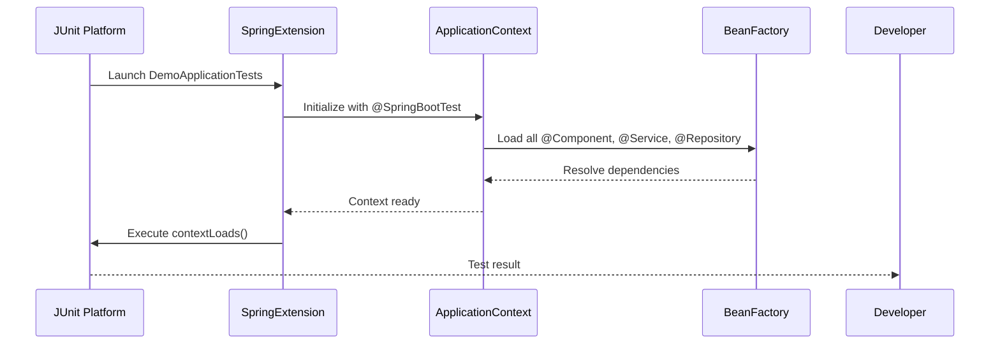
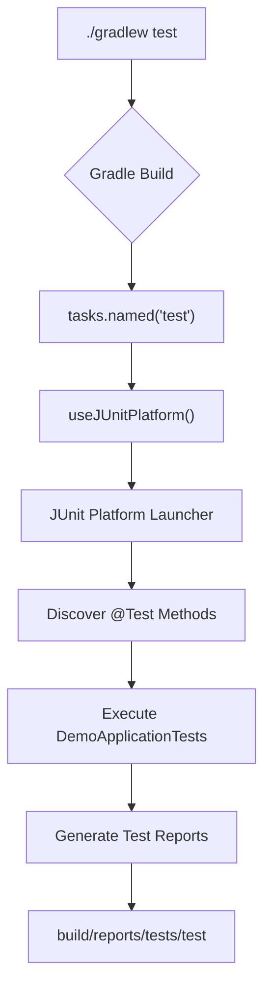
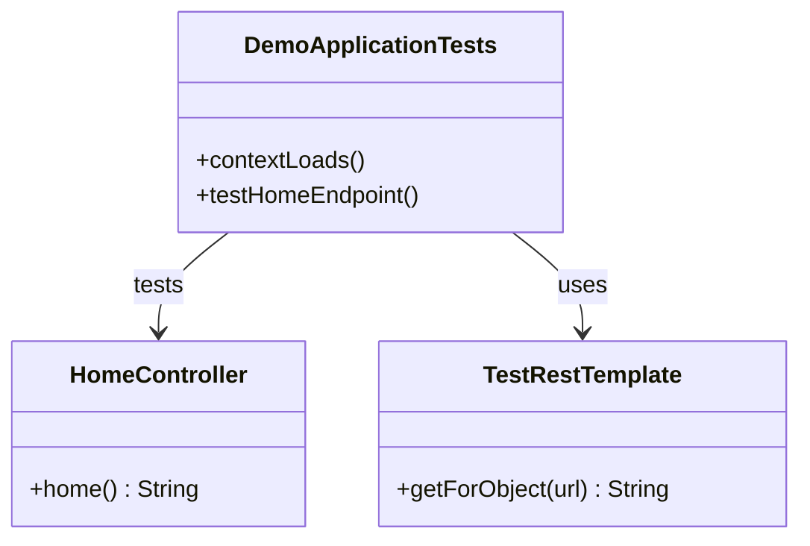

# Testing Strategy

<cite>
**Referenced Files in This Document**   
- [DemoApplicationTests.kt](file://src/test/kotlin/com/example/demo/DemoApplicationTests.kt)
- [build.gradle](file://build.gradle)
- [Controller.kt](file://src/main/kotlin/com/example/demo/controllers/Controller.kt)
</cite>

## Table of Contents
1. [Integration Testing with @SpringBootTest](#integration-testing-with-springspringboottest)
2. [Test Dependencies in build.gradle](#test-dependencies-in-buildgradle)
3. [Test Execution and JUnit Platform Integration](#test-execution-and-junit-platform-integration)
4. [Extending Test Suite for HomeController](#extending-test-suite-for-homecontroller)
5. [Unit Tests vs Integration Tests in Spring Boot with Kotlin](#unit-tests-vs-integration-tests-in-spring-boot-with-kotlin)
6. [Common Testing Issues and Debugging Strategies](#common-testing-issues-and-debugging-strategies)
7. [Code Coverage and Test Lifecycle Management](#code-coverage-and-test-lifecycle-management)

## Integration Testing with @SpringBootTest

The `DemoApplicationTests.kt` file serves as the primary integration test class for the Spring Boot application. Annotated with `@SpringBootTest`, this test ensures that the entire Spring application context loads successfully without configuration errors. The annotation triggers the creation of a complete application context, loading all beans, configurations, and components as defined in the application.

The `contextLoads()` test method is a minimal but critical verification that the Spring container can initialize all beans and resolve dependencies without exceptions. This test does not assert specific behaviors but confirms that the application's core infrastructure is sound. It acts as a smoke test during development and CI/CD pipelines, catching configuration issues early.

**Diagram sources**
- [DemoApplicationTests.kt](file://src/test/kotlin/com/example/demo/DemoApplicationTests.kt#L5-L12)

**Section sources**
- [DemoApplicationTests.kt](file://src/test/kotlin/com/example/demo/DemoApplicationTests.kt#L5-L12)

## Test Dependencies in build.gradle

The `build.gradle` file defines essential testing dependencies that enable comprehensive test execution. The `spring-boot-starter-test` dependency provides a complete suite of testing utilities including Spring Test, JUnit Jupiter, Mockito, AssertJ, and JSONPath. This starter simplifies dependency management by bundling commonly used test libraries.

The `kotlin-test-junit5` dependency integrates Kotlin-specific testing features with JUnit 5, enabling idiomatic Kotlin syntax for test assertions and lifecycle methods. Additionally, `testRuntimeOnly 'org.junit.platform:junit-platform-launcher'` ensures proper test discovery and execution through the JUnit Platform, which is required for running tests in IDEs and build tools.

These dependencies are scoped to the testImplementation configuration, ensuring they are not included in the production artifact while being available during test compilation and execution.

**Section sources**
- [build.gradle](file://build.gradle#L32-L34)

## Test Execution and JUnit Platform Integration

Test execution is managed through Gradle via the `./gradlew test` command, which triggers the test task configured in `build.gradle`. The `tasks.named('test') { useJUnitPlatform() }` configuration explicitly enables JUnit 5 (JUnit Platform) as the test engine, allowing the execution of JUnit Jupiter, JUnit Vintage, and other compatible test frameworks.

The JUnit Platform provides a modern foundation for running tests with features like dynamic tests, parameterized tests, and rich extension models. When tests are executed, the platform discovers test classes annotated with `@Test`, `@SpringBootTest`, or other JUnit annotations and runs them in an isolated environment.

This integration ensures compatibility with IDEs (IntelliJ IDEA, VS Code) and CI/CD systems, providing consistent test results across different environments. Test reports are automatically generated in the `build/reports/tests/test` directory, including both XML and HTML formats for easy analysis.

**Diagram sources**
- [build.gradle](file://build.gradle#L45)

**Section sources**
- [build.gradle](file://build.gradle#L45)

## Extending Test Suite for HomeController

The `HomeController` class, located in `Controller.kt`, can be tested by extending the test suite with endpoint-specific integration tests. While `contextLoads()` verifies general context initialization, additional tests should validate HTTP endpoint behavior, response content, and status codes.

To test the `HomeController`, new test methods can be added to `DemoApplicationTests.kt` or a dedicated `HomeControllerTest.kt` file can be created. These tests would typically use `@Autowired` to inject `TestRestTemplate` or `WebTestClient` for making HTTP requests to the `/` endpoint and asserting the expected "Hello, Spring" response.

The test would verify that the `@RestController` annotation is properly configured, the `@GetMapping` mapping is correct, and the Kotlin function returns the expected string response. This approach ensures that both the web layer and Spring MVC configuration are functioning as intended.

**Diagram sources**
- [Controller.kt](file://src/main/kotlin/com/example/demo/controllers/Controller.kt#L5-L10)
- [DemoApplicationTests.kt](file://src/test/kotlin/com/example/demo/DemoApplicationTests.kt#L5-L12)

**Section sources**
- [Controller.kt](file://src/main/kotlin/com/example/demo/controllers/Controller.kt#L5-L10)

## Unit Tests vs Integration Tests in Spring Boot with Kotlin

In Spring Boot with Kotlin, unit tests and integration tests serve distinct purposes. Unit tests focus on isolated components, typically testing individual functions or classes without the Spring context. They use mocking frameworks like Mockito to simulate dependencies and are faster to execute.

Integration tests, exemplified by `DemoApplicationTests.kt`, load the full Spring application context and test the interaction between components. They verify that configurations, dependency injection, and cross-cutting concerns (security, transactions) work as expected. While slower, they provide higher confidence in the system's overall behavior.

Best practices recommend a testing pyramid: many unit tests, fewer integration tests, and even fewer end-to-end tests. For Kotlin code, leverage Kotlin's null safety and data classes in test assertions, and use Kotlin-specific assertion libraries for more expressive test code.

**Section sources**
- [DemoApplicationTests.kt](file://src/test/kotlin/com/example/demo/DemoApplicationTests.kt#L5-L12)
- [Controller.kt](file://src/main/kotlin/com/example/demo/controllers/Controller.kt#L5-L10)

## Common Testing Issues and Debugging Strategies

Common testing issues include context loading failures, bean creation exceptions, and configuration conflicts. When `contextLoads()` fails, examine the stack trace to identify missing beans, circular dependencies, or misconfigured properties.

Debugging strategies include:
- Using `@TestConfiguration` to override problematic beans
- Enabling debug logging for Spring Test
- Checking `application.properties` for conflicting settings
- Verifying that all required dependencies are in `build.gradle`
- Using `@DirtiesContext` when tests modify the application state

For test execution issues, ensure that `useJUnitPlatform()` is configured and that the correct JUnit dependencies are present. In IDEs, verify that the test runner is set to JUnit 5.

**Section sources**
- [build.gradle](file://build.gradle#L32-L34)
- [DemoApplicationTests.kt](file://src/test/kotlin/com/example/demo/DemoApplicationTests.kt#L5-L12)

## Code Coverage and Test Lifecycle Management

Code coverage should be monitored to ensure critical paths are tested, but 100% coverage should not be the primary goal. Focus on testing business logic, edge cases, and error handling rather than trivial getters and setters.

Test lifecycle management in JUnit 5 involves annotations like `@BeforeEach`, `@AfterEach`, `@BeforeAll`, and `@AfterAll` to set up and tear down test state. In Spring tests, `@SpringBootTest` manages the application context lifecycle, caching it between tests for performance.

Consider using `@WebMvcTest` for faster controller tests that don't require the full context, and `@DataJpaTest` for repository layer tests. These slice tests provide faster feedback during development while full integration tests run in CI/CD pipelines.

**Section sources**
- [build.gradle](file://build.gradle#L45)
- [DemoApplicationTests.kt](file://src/test/kotlin/com/example/demo/DemoApplicationTests.kt#L5-L12)